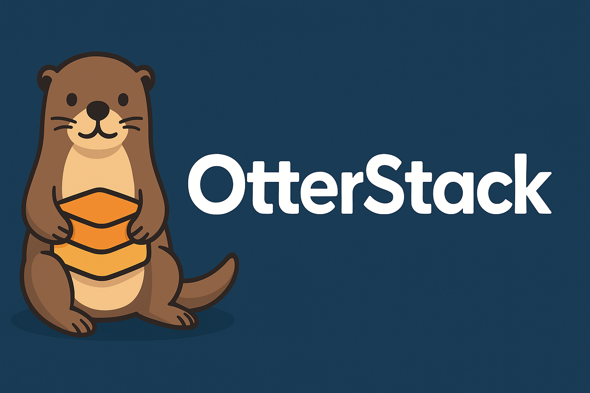

A Docker-based media management solution with automated deployment and management tools.

## Quick Start

1. **Configure Environment**
   ```bash
   cp .env.example .env
   # Edit .env with your settings
   ```
   - Default `DOMAIN_SUFFIX` is `.lan` to avoid Apple mDNS hijacking of `.local` on iOS/macOS. Change it here if you need a different internal domain.

2. **Create required secrets**
   - See `secrets/README.md` for the required files and permissions.

3. **Make the script executable**
   ```bash
   chmod +x media-stack.sh
   ```

4. **Start the stack**
   ```bash
   ./media-stack.sh start
   ```

## Usage

```bash
./media-stack.sh {start|stop|restart|status|logs}
```

### Commands

- `start` - Start all services
- `stop` - Stop all services
- `restart` - Restart all services
- `status` - Show status of all services
- `logs [service]` - View logs (optionally for a specific service)

## Remote Access with Cloudflare Tunnel

This stack includes Cloudflare Tunnel (cloudflared) for secure remote access without opening ports on your router.

### Setup Cloudflare Tunnel

1. **Create a tunnel** in the [Cloudflare Zero Trust Dashboard](https://one.dash.cloudflare.com/)
2. **Configure your tunnel token** as a Docker secret:
   ```bash
   printf '%s' 'your_tunnel_token_here' > secrets/cloudflare_token
   chmod 600 secrets/cloudflare_token
   ```
3. **Set up tunnel routes** in the Cloudflare dashboard for your services
4. **Start the cloudflared service**:
   ```bash
   docker compose up -d cloudflared
   ```

For detailed setup instructions, see `cloudflared/README.md`.

## Documentation

- Architecture overview: `docs/NETWORK_ARCHITECTURE.md`
- VPN setup: `docs/SETUP-VPN.md`
- VPN deep dive: `docs/VPN-ARCHITECTURE.md`
- Monitoring: `monitoring/README.md`
- Secrets: `secrets/README.md`

## Security with Fail2ban

This stack includes Fail2ban for automatic IP banning to protect against brute force attacks and malicious bots.

### Features

- **Authentication Protection**: Automatically bans IPs with repeated 401/403 errors
- **Bot/Scanner Protection**: Blocks IPs trying to access common vulnerable paths
- **Email Notifications**: Optional alerts when IPs are banned (requires SMTP configuration)

### Quick Commands

View banned IPs:
```bash
docker exec fail2ban fail2ban-client status traefik-auth
```

Manually unban an IP:
```bash
docker exec fail2ban fail2ban-client set traefik-auth unbanip <IP_ADDRESS>
```

For detailed configuration and usage, see `fail2ban/README.md`.

## VPN Protection for qBittorrent

This stack includes Gluetun VPN integration to protect qBittorrent torrent traffic through Mullvad WireGuard.

### Features

- All torrent traffic routed through encrypted VPN tunnel
- Automatic killswitch prevents IP leaks
- Port forwarding support for better seeding
- Other services (Jellyfin, Sonarr, Radarr) bypass VPN for better performance

### Quick Setup

1. Sign up for [Mullvad VPN](https://mullvad.net/)
2. Generate WireGuard credentials in your Mullvad account
3. Store WireGuard credentials:
   - Save the Mullvad `PrivateKey` to `secrets/wireguard_private_key` (single line)
   - Add the address to `.env`:
     ```bash
     WIREGUARD_ADDRESSES=10.x.x.x/32
     ```
4. Start the services:
   ```bash
   cd qbittorrent
   docker-compose up -d
   ```

For detailed setup instructions, see [SETUP-VPN.md](./docs/SETUP-VPN.md).

For architecture details, see [VPN-ARCHITECTURE.md](./docs/VPN-ARCHITECTURE.md).
