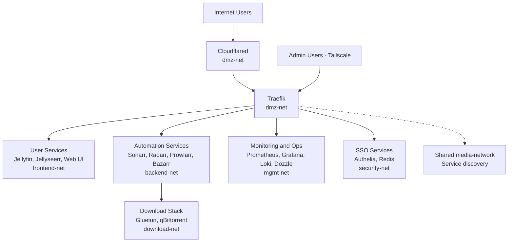
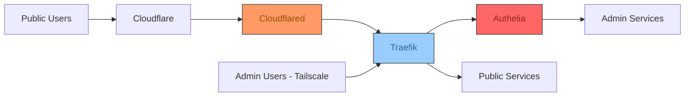
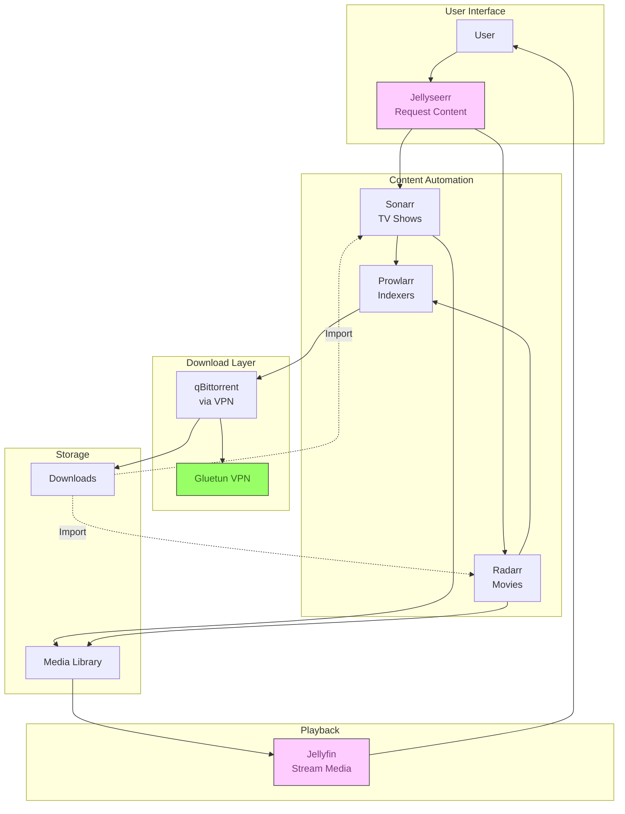
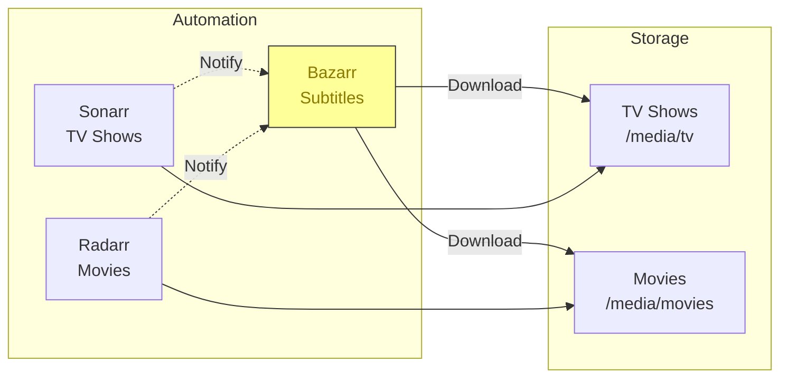
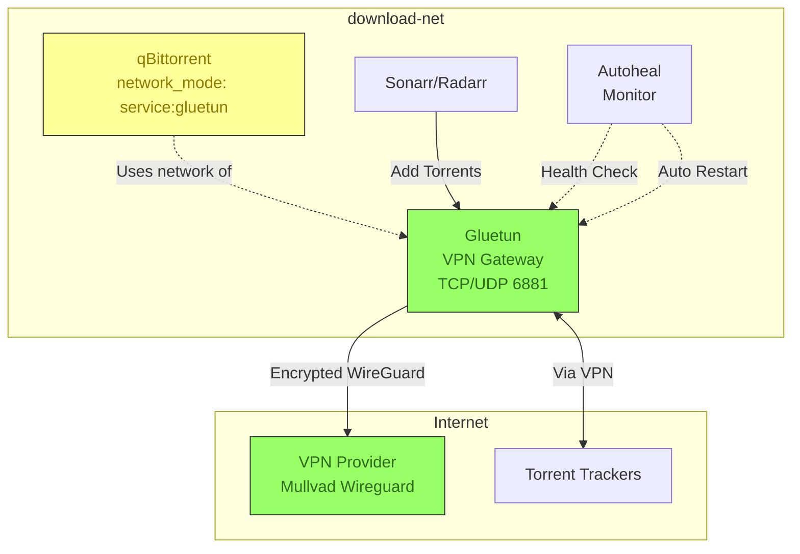
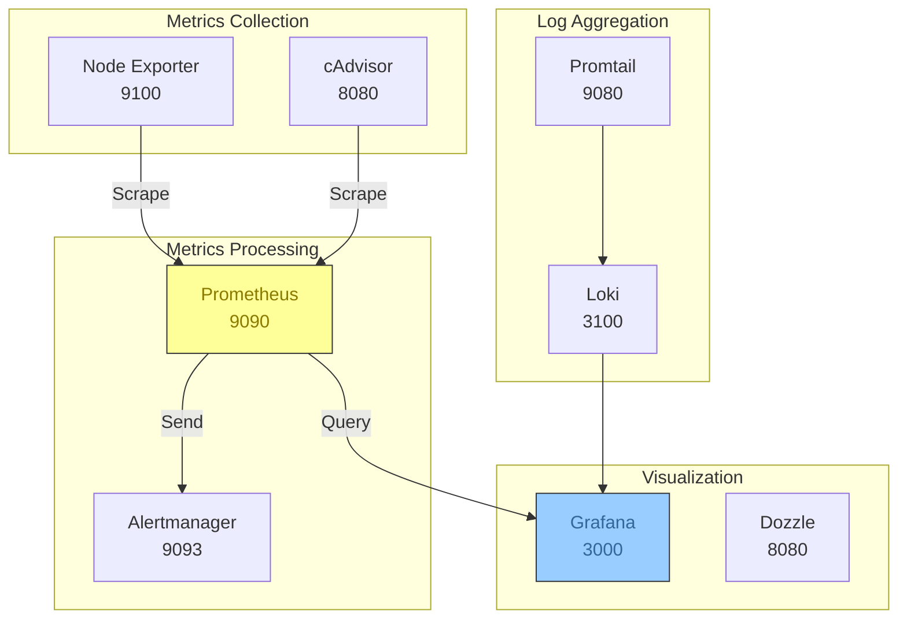
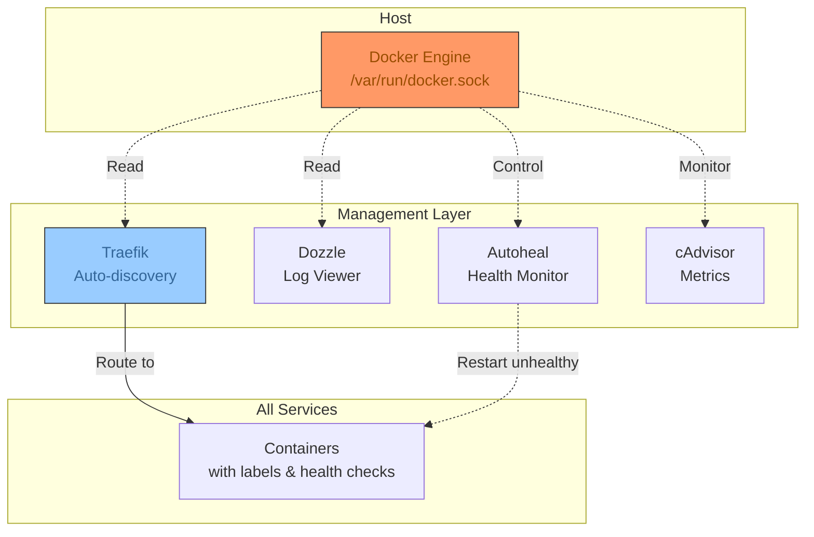

# Network Architecture

## Overview
This document describes the current network architecture for the media server host running Docker containers orchestrated through Docker Compose. The stack uses segmented bridge networks, Traefik entrypoints with TLS, Authelia for SSO on admin services, and Cloudflared for public access. A legacy shared `media-network` remains attached to most services for Traefik discovery and transition compatibility.

## 1. Network Topology Overview



## 2. External Access and Ingress



Public services include Jellyfin, Jellyseerr, and the Web UI landing page. Admin services are exposed on Traefik entrypoints and protected by Authelia. Tailscale provides the access boundary for admin entrypoints.

## 3. Port Exposure Strategy

### Traefik Entrypoints (Host Ports)

| Host Port | Entrypoint | Typical Service | Notes |
|---|---|---|---|
| 80 | web | Jellyfin, Jellyseerr, Web UI (public) | HTTP entrypoint, routed by host header |
| 3000 | grafana | Grafana | TLS + Authelia |
| 3001 | web-ui | Web UI admin | TLS + Authelia |
| 5055 | jellyseerr | Jellyseerr admin | TLS + Authelia |
| 6767 | bazarr | Bazarr | TLS + Authelia |
| 7878 | radarr | Radarr | TLS + Authelia |
| 8080 | qbittorrent | qBittorrent | TLS + Authelia |
| 8081 | cadvisor | cAdvisor | TLS + Authelia |
| 8082 | dozzle | Dozzle | TLS + Authelia |
| 8085 | traefik | Traefik dashboard | TLS + Authelia |
| 8096 | jellyfin | Jellyfin admin | TLS (no Authelia by default) |
| 8989 | sonarr | Sonarr | TLS + Authelia |
| 9090 | prometheus | Prometheus | TLS + Authelia |
| 9091 | authelia | Authelia portal | TLS |
| 9093 | alertmanager | Alertmanager | TLS + Authelia |
| 9696 | prowlarr | Prowlarr | TLS + Authelia |

TLS is enabled per-entrypoint. There is no dedicated port 443 entrypoint in this stack.

### Non-Traefik Host Ports

- **6881 (TCP/UDP)**: BitTorrent traffic (Gluetun port forwarding)

## 4. Network Segmentation and Modes

### Network Segments

- **dmz-net**: Traefik, Cloudflared
- **frontend-net**: Jellyfin, Jellyseerr, Web UI, Grafana
- **backend-net**: Sonarr, Radarr, Prowlarr, Bazarr, Jellyseerr
- **download-net**: Gluetun, qBittorrent (via Gluetun), Sonarr, Radarr, Prowlarr
- **mgmt-net**: Prometheus, Alertmanager, Grafana, cAdvisor, Node Exporter, Dozzle, Loki, Promtail, Autoheal, Backup
- **security-net**: Authelia, Redis, Traefik (auth routing)
- **media-network**: Shared bridge for Traefik service discovery and legacy compatibility

### Network Modes

- **Bridge networks**: All segmented networks above plus the shared `media-network`
- **Host network**: `fail2ban` (needs host iptables and log access)
- **Service network mode**: `qbittorrent` uses `network_mode: service:gluetun`

## 5. Media Content Flow



## 6. Subtitle Management Flow



## 7. VPN and Download Security



## 8. Monitoring and Logging



## 9. Service Discovery and Management



## 10. Access Paths

- **Public access**: Cloudflared tunnel to Traefik entrypoint `web` (port 80). Hostnames map to `PUBLIC_JELLYFIN_DOMAIN`, `PUBLIC_JELLYSEERR_DOMAIN`, and `PUBLIC_DASHBOARD_DOMAIN`.
- **Local access**: Jellyfin and Jellyseerr can also be accessed via `.lan` domains on port 80.
- **Admin access**: `https://<TAILSCALE_HOST>:<entrypoint>` with Authelia protecting admin services.

## 11. Service Communication Patterns

### Content Request Flow
```
User -> Jellyseerr -> Sonarr/Radarr -> Prowlarr (indexers) -> qBittorrent (via Gluetun VPN) -> Downloads
```

### Content Organization Flow
```
Downloads -> Sonarr/Radarr (organize) -> Media Storage -> Jellyfin (stream)
Bazarr -> Download subtitles -> Media Storage
```

### Monitoring Flow
```
Node Exporter/cAdvisor -> Prometheus -> Grafana (visualization)
Prometheus -> Alertmanager (alerts)
Promtail -> Loki -> Grafana (logs)
```

## 12. Security Layers

1. **VPN Isolation**: All torrent traffic forced through Gluetun VPN
2. **Fail2ban**: Monitors logs and blocks malicious IPs at host level
3. **Traefik**: Reverse proxy with per-entrypoint TLS
4. **Authelia**: SSO protection for admin services
5. **Cloudflared**: Secure public access without port forwarding
6. **Secrets**: Sensitive credentials stored as Docker secrets
7. **Autoheal**: Automatically restarts unhealthy containers

## 13. Dependencies

1. Traefik (reverse proxy and entrypoints)
2. Authelia + Redis (SSO services)
3. Gluetun (VPN gateway)
4. qBittorrent (depends on Gluetun network)
5. Cloudflared (depends on Traefik)
6. Jellyfin, Jellyseerr, Servarr stack
7. Monitoring and logging stack

## 14. Resource Allocation

- **Heavy**: Jellyfin (2G), qBittorrent (4G), Sonarr (1G)
- **Medium**: Grafana (256M), Radarr/Bazarr (512M), Prometheus (512M)
- **Light**: Alertmanager/cAdvisor/Node Exporter/Authelia (128M to 256M)

## 15. Health Monitoring

All services implement health checks:
- **HTTP-based**: Most web services (curl/wget to health endpoints)
- **Command-based**: fail2ban (fail2ban-client ping)
- **VPN-specific**: Gluetun (connectivity to 1.1.1.1:443)

## 16. Key Features

1. **Auto-healing**: Gluetun VPN container auto-restarts on failure
2. **Service discovery**: Traefik auto-discovers services via Docker labels
3. **Centralized logging**: Loki and Dozzle provide log access
4. **Metrics collection**: Prometheus and Grafana cover the full stack
5. **Secure downloads**: VPN kill-switch ensures no leaks
