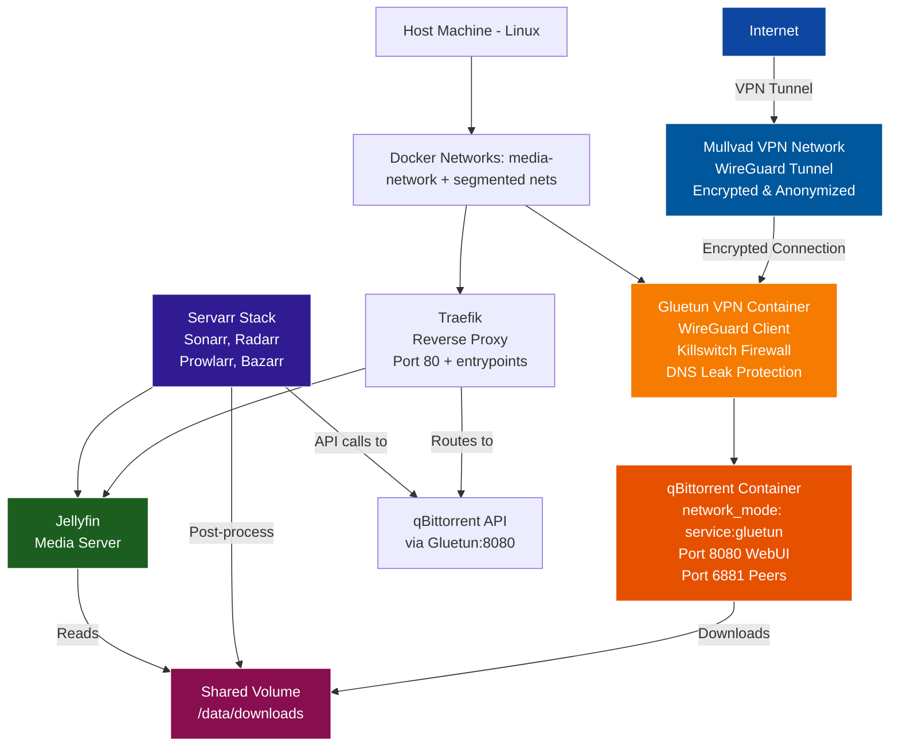
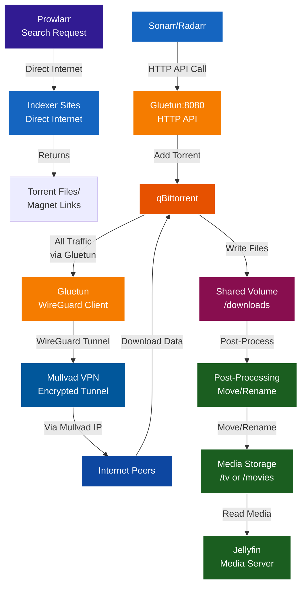
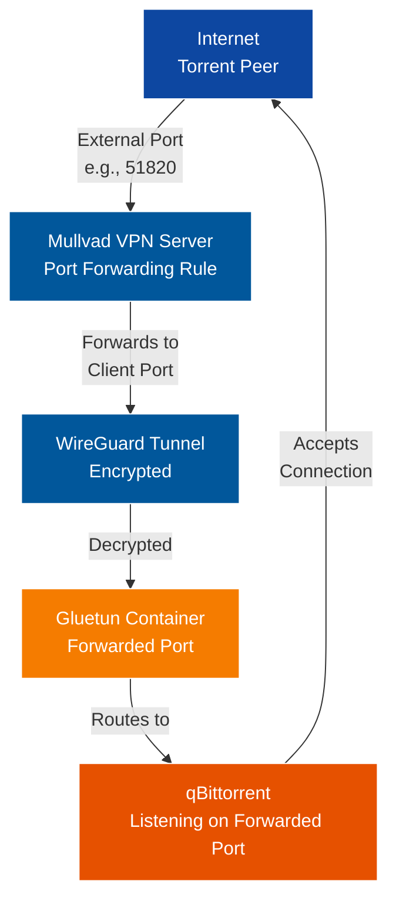

# VPN Architecture for Media Stack

**Document Version**: 1.0  
**Last Updated**: October 22, 2025  
**Purpose**: Protect qBittorrent torrent traffic using Mullvad VPN with WireGuard protocol

---

## Table of Contents

1. [Architecture Overview](#architecture-overview)
2. [Network Topology](#network-topology)
3. [Component Architecture](#component-architecture)
4. [Security Architecture](#security-architecture)
5. [Data Flow Diagrams](#data-flow-diagrams)
6. [Port Mapping Strategy](#port-mapping-strategy)
7. [Network Isolation Model](#network-isolation-model)
8. [Failure Scenarios](#failure-scenarios)

---

## Architecture Overview

### High-Level Design



### Design Principles

1. **Selective VPN Routing**: Only torrent traffic goes through VPN
2. **Network Isolation**: qBittorrent cannot access internet directly
3. **Zero Trust**: Built-in killswitch prevents IP leaks
4. **Performance Optimization**: Media streaming and API calls bypass VPN
5. **Maintainability**: Modular container architecture

---

## Network Topology

### Container Network Modes

| Container Name | Network Mode | Internet Access |
|---|---|---|
| traefik | bridge | Direct |
| gluetun | bridge | VPN Tunnel |
| qbittorrent | service:gluetun | Via Gluetun |
| jellyfin | bridge | Direct |
| sonarr | bridge | Direct |
| radarr | bridge | Direct |
| prowlarr | bridge | Direct |
| bazarr | bridge | Direct |
| jellyseerr | bridge | Direct |

### Network Flow Map

| Traffic Type | Path |
|---|---|
| Torrent Download | qBittorrent → Gluetun → Mullvad |
| Torrent Upload | qBittorrent → Gluetun → Mullvad |
| Tracker Communication | qBittorrent → Gluetun → Mullvad |
| WebUI Access (Internal) | Browser → Traefik → Gluetun:8080 |
| API Calls (Sonarr/Radarr) | Servarr → Gluetun:8080 |
| Media Streaming | Browser → Traefik → Jellyfin |
| Metadata Fetching | Sonarr/Radarr → Direct Internet |
| Indexer Searches | Prowlarr → Direct Internet |


### IP Address Visibility

| Component | Visible IP | Location |
|---|---|---|
| qBittorrent | Mullvad VPN IP | VPN Server Region |
| Jellyfin | Home IP | Local Network |
| Sonarr/Radarr | Home IP | Local Network |
| Traefik | Home IP | Local Network |

---

## Component Architecture

### Gluetun VPN Container

```text
┌───────────────────────────────────────────────────────────┐
│                    Gluetun Container                      │
│  ┌─────────────────────────────────────────────────────┐  │
│  │                 WireGuard Client                    │  │
│  │  • Private Key Authentication                       │  │
│  │  • ChaCha20Poly1305 Encryption                      │  │
│  │  • Automatic Reconnection                           │  │
│  │  • Health Monitoring                                │  │
│  └─────────────────────────────────────────────────────┘  │
│                          ↓                                │
│  ┌─────────────────────────────────────────────────────┐  │
│  │              Firewall & Killswitch                  │  │
│  │  • DROP all non-VPN traffic                         │  │
│  │  • Allow local subnet (for Traefik/Servarr)         │  │
│  │  • Block on VPN disconnect                          │  │
│  │  • Port forwarding rules                            │  │
│  └─────────────────────────────────────────────────────┘  │
│                          ↓                                │
│  ┌─────────────────────────────────────────────────────┐  │
│  │                DNS Configuration                    │  │
│  │  • Use Mullvad DNS servers                          │  │
│  │  • Prevent DNS leaks                                │  │
│  │  • Override system DNS                              │  │
│  └─────────────────────────────────────────────────────┘  │
│                          ↓                                │
│  ┌─────────────────────────────────────────────────────┐  │
│  │            Network Interface Sharing                │  │
│  │  • Expose ports: 8080, 6881                         │  │
│  │  • Share network with qBittorrent                   │  │
│  │  • HTTP proxy (optional)                            │  │
│  └─────────────────────────────────────────────────────┘  │
└───────────────────────────────────────────────────────────┘
```

**Key Capabilities**:
- `CAP_ADD: NET_ADMIN` - Required for creating VPN tunnels
- `/dev/net/tun` device access - TUN interface for tunnel
- Environment-based configuration - No manual file editing
- Automatic server selection - Based on regions/cities
- Built-in health checks - Connection monitoring

### qBittorrent Container

```text
┌───────────────────────────────────────────────────────────┐
│               qBittorrent Container                       │
│  ┌─────────────────────────────────────────────────────┐  │
│  │              Network Configuration                  │  │
│  │  network_mode: "service:gluetun"                    │  │
│  │  • No independent network interface                 │  │
│  │  • All traffic routed through Gluetun               │  │
│  │  • Cannot bypass VPN                                │  │
│  └─────────────────────────────────────────────────────┘  │
│                          ↓                                │
│  ┌─────────────────────────────────────────────────────┐  │
│  │              Torrent Engine                         │  │
│  │  • libtorrent library                               │  │
│  │  • DHT, PEX, LSD protocols                          │  │
│  │  • Sequential downloading                           │  │
│  │  • Seeding management                               │  │
│  └─────────────────────────────────────────────────────┘  │
│                          ↓                                │
│  ┌─────────────────────────────────────────────────────┐  │
│  │                 WebUI (VueTorrent)                  │  │
│  │  • Web-based interface                              │  │
│  │  • REST API                                         │  │
│  │  • Port 8080 (accessed via Gluetun)                 │  │
│  └─────────────────────────────────────────────────────┘  │
│                          ↓                                │
│  ┌─────────────────────────────────────────────────────┐  │
│  │              Volume Mounts                          │  │
│  │  /config  → Configuration & database                │  │
│  │  /downloads → Shared download directory             │  │
│  └─────────────────────────────────────────────────────┘  │
└───────────────────────────────────────────────────────────┘
```

**Critical Design Decisions**:
- No exposed ports on container itself (uses Gluetun's ports)
- Depends on Gluetun (ensures VPN starts first)
- Health check disabled (would fail due to network mode)
- Traefik labels moved to Gluetun container

---

## Security Architecture

### Defense in Depth Model

```
┌───────────────────────────────────────────────────────────┐
│  Layer 1: Container Isolation                             │
│  ───────────────────────────────────────────────────────  │
│  • qBittorrent runs in isolated container                 │
│  • No host network access                                 │
│  • Limited system capabilities                            │
│  • Read-only root filesystem (optional)                   │
└───────────────────────────────────────────────────────────┘
                            ↓
┌───────────────────────────────────────────────────────────┐
│  Layer 2: Network Isolation                               │
│  ───────────────────────────────────────────────────────  │
│  • network_mode: service:gluetun                          │
│  • No direct internet routing                             │
│  • All packets go through Gluetun                         │
│  • Cannot bypass VPN tunnel                               │
└───────────────────────────────────────────────────────────┘
                            ↓
┌───────────────────────────────────────────────────────────┐
│  Layer 3: VPN Killswitch                                  │
│  ───────────────────────────────────────────────────────  │
│  • iptables rules block non-VPN traffic                   │
│  • Automatic enforcement on VPN failure                   │
│  • No fallback to direct connection                       │
│  • Drops packets instead of routing                       │
└───────────────────────────────────────────────────────────┘
                            ↓
┌───────────────────────────────────────────────────────────┐
│  Layer 4: WireGuard Encryption                            │
│  ───────────────────────────────────────────────────────  │
│  • ChaCha20Poly1305 authenticated encryption              │
│  • Perfect forward secrecy                                │
│  • Regular key rotation                                   │
│  • Modern cryptographic primitives                        │
└───────────────────────────────────────────────────────────┘
                            ↓
┌───────────────────────────────────────────────────────────┐
│  Layer 5: VPN Provider (Mullvad)                          │
│  ───────────────────────────────────────────────────────  │
│  • No-logs policy (independently audited)                 │
│  • Shared IP addresses (anonymity)                        │
│  • Diskless infrastructure                                │
│  • Anonymous account system                               │
└───────────────────────────────────────────────────────────┘
```

### Threat Model & Mitigations

| Threat | Mitigation |
|---|---|
| ISP Monitoring | WireGuard encryption + Mullvad IP |
| IP Address Leak | Killswitch + network_mode isolation |
| DNS Leak | Forced VPN DNS servers |
| VPN Disconnection | Automatic killswitch activation |
| Container Escape | Docker isolation + limited caps |
| Traffic Correlation | Mullvad's shared IPs |
| WebRTC Leak | Not applicable (no browser in Docker) |
| IPv6 Leak | IPv6 disabled in Gluetun |

### Access Control Matrix

| Source | Destination | Allowed | Protocol |
|---|---|---|---|
| qBittorrent | Internet | NO | Any |
| qBittorrent | Gluetun | YES | All |
| Gluetun | Mullvad VPN | YES | WireGuard |
| Gluetun | Internet | NO | Direct |
| Traefik | Gluetun:8080 | YES | HTTP |
| Sonarr/Radarr | Gluetun:8080 | YES | HTTP/API |
| Local Subnet | Gluetun:8080 | YES | HTTP |
| Internet | qBittorrent | NO | Direct |
| Internet | Gluetun:6881 | YES | Via VPN Port |

---

## Data Flow Diagrams

### Torrent Download Flow



### Network Packet Flow

```text
Outbound Packet (qBittorrent → Peer):
┌────────────────────────────────────────────────────────────┐
│ 1. Application Layer                                       │
│    qBittorrent generates torrent protocol packet           │
└────────────────────────────────────────────────────────────┘
                            ↓
┌────────────────────────────────────────────────────────────┐
│ 2. Network Stack (qBittorrent container)                   │
│    Packet sent to network interface                        │
│    → Routed to Gluetun (due to network_mode)               │
└────────────────────────────────────────────────────────────┘
                            ↓
┌────────────────────────────────────────────────────────────┐
│ 3. Gluetun Firewall                                        │
│    iptables checks packet:                                 │
│    → Destination = VPN tunnel? ACCEPT                      │
│    → Destination = Internet direct? DROP                   │
└────────────────────────────────────────────────────────────┘
                            ↓
┌────────────────────────────────────────────────────────────┐
│ 4. WireGuard Encapsulation                                 │
│    Original packet encrypted and wrapped:                  │
│    [Original Packet] → [WireGuard Header][Encrypted Data]  │
└────────────────────────────────────────────────────────────┘
                            ↓
┌────────────────────────────────────────────────────────────┐
│ 5. Physical Network                                        │
│    Encrypted packet sent to Mullvad server                 │
│    Source IP: Gluetun container                            │
│    Destination IP: Mullvad VPN server                      │
└────────────────────────────────────────────────────────────┘
                            ↓
┌────────────────────────────────────────────────────────────┐
│ 6. Mullvad Server                                          │
│    Decrypts packet, forwards to destination                │
│    Source IP changed to: Mullvad public IP                 │
└────────────────────────────────────────────────────────────┘
                            ↓
                      Torrent Peer
```

### Internal API Communication

```
Sonarr/Radarr → qBittorrent API:
┌──────────┐
│  Sonarr  │
└──────────┘
     ↓
Request: POST http://gluetun:8080/api/v2/torrents/add
     ↓
┌──────────────────────────────────────────────────────────┐
│  Docker DNS Resolution                                   │
│  "gluetun" → 172.18.0.x (Gluetun container IP)           │
└──────────────────────────────────────────────────────────┘
     ↓
┌──────────────────────────────────────────────────────────┐
│  Gluetun Container (Port 8080)                           │
│  Forwards to qBittorrent (shares network stack)          │
└──────────────────────────────────────────────────────────┘
     ↓
┌──────────────────────────────────────────────────────────┐
│  qBittorrent Application (Listening on 8080)             │
│  Processes API request                                   │
│  Returns JSON response                                   │
└──────────────────────────────────────────────────────────┘
     ↓
Response: {"hash": "abc123...", "status": "downloading"}
     ↓
┌──────────┐
│  Sonarr  │ Updates download status
└──────────┘
```

---

## Port Mapping Strategy

### Port Allocation Table

| Port | Protocol | Container | Purpose | Exposed To |
|------|----------|-----------|---------|------------|
| 8080 | TCP | Traefik entrypoint -> Gluetun | qBittorrent WebUI | Tailscale (Authelia) |
| VPN_INPUT_PORTS (default 6881) | TCP | Gluetun | Torrent incoming | Internet (VPN) |
| VPN_INPUT_PORTS (default 6881) | UDP | Gluetun | Torrent incoming | Internet (VPN) |
| 8888 | TCP | Gluetun | HTTP proxy | Optional (disabled by default) |
| 8388 | TCP | Gluetun | Shadowsocks | Disabled |

### Port Forwarding Architecture



**Port Forwarding Configuration**:
- Mullvad provides a random port (e.g., 51820)
- Set `.env` → `VPN_INPUT_PORTS=51820` so Gluetun opens that port via `FIREWALL_VPN_INPUT_PORTS`
- Configure qBittorrent (WebUI or `qBittorrent.conf`) to listen on the same port
- Re-run `docker compose up -d` so the Gluetun container reloads the updated environment
- Result: External peers connect to Mullvad:51820 → reaches qBittorrent:51820

### Traefik Routing

```
Browser Request: https://<TAILSCALE_HOST>:8080
        ↓
┌──────────────────────────────────────────────────────────┐
│  Traefik Router (examines labels on Gluetun)             │
│  Rule: Host(`<TAILSCALE_HOST>`)                          │
└──────────────────────────────────────────────────────────┘
        ↓
┌──────────────────────────────────────────────────────────┐
│  Traefik Service                                         │
│  Backend: gluetun:8080                                   │
└──────────────────────────────────────────────────────────┘
        ↓
┌──────────────────────────────────────────────────────────┐
│  Gluetun Container (Port 8080)                           │
│  Forwards to qBittorrent WebUI                           │
└──────────────────────────────────────────────────────────┘
        ↓
┌──────────────────────────────────────────────────────────┐
│  qBittorrent WebUI                                       │
│  Serves web interface                                    │
└──────────────────────────────────────────────────────────┘
```

---

## Network Isolation Model

### Container Namespace Sharing

```
Normal Docker Container:
┌─────────────────────────────────────────┐
│  Container: jellyfin                    │
│  ┌───────────────────────────────────┐  │
│  │  Network Namespace (Isolated)     │  │
│  │  • eth0: 172.18.0.5               │  │
│  │  • lo: 127.0.0.1                  │  │
│  │  • Routes: default via gateway    │  │
│  └───────────────────────────────────┘  │
└─────────────────────────────────────────┘

qBittorrent with network_mode: service:gluetun:
┌─────────────────────────────────────────────────────┐
│  Container: gluetun                                 │
│  ┌───────────────────────────────────────────────┐  │
│  │  Network Namespace (Shared)                   │  │
│  │  • eth0: 172.18.0.10 (Docker network)         │  │
│  │  • wg0: 10.64.x.x (WireGuard tunnel)          │  │
│  │  • lo: 127.0.0.1                              │  │
│  │  • Routes: default via wg0 (VPN)              │  │
│  │  • iptables: killswitch rules active          │  │
│  │  ┌─────────────────────────────────────────┐  │  │
│  │  │  qBittorrent Process                    │  │  │
│  │  │  • Shares same namespace                │  │  │
│  │  │  • Uses same network interfaces         │  │  │
│  │  │  • Subject to same firewall rules       │  │  │
│  │  │  • Cannot create own routes             │  │  │
│  │  └─────────────────────────────────────────┘  │  │
│  └───────────────────────────────────────────────┘  │
└─────────────────────────────────────────────────────┘
```

### Firewall Rules (iptables)

```
Gluetun Killswitch Rules:
┌──────────────────────────────────────────────────────────┐
│  Chain INPUT                                             │
│  ├─ ACCEPT established,related connections               │
│  ├─ ACCEPT from lo (loopback)                            │
│  ├─ ACCEPT from 192.168.1.0/24 (local subnet)            │
│  ├─ ACCEPT on wg0 (WireGuard interface)                  │
│  └─ DROP all other INPUT                                 │
└──────────────────────────────────────────────────────────┘
┌──────────────────────────────────────────────────────────┐
│  Chain OUTPUT                                            │
│  ├─ ACCEPT to lo (loopback)                              │
│  ├─ ACCEPT to 192.168.1.0/24 (local subnet)              │
│  ├─ ACCEPT to Mullvad VPN server (UDP 51820)             │
│  ├─ ACCEPT to wg0 (WireGuard interface)                  │
│  └─ DROP all other OUTPUT                                │
└──────────────────────────────────────────────────────────┘
┌──────────────────────────────────────────────────────────┐
│  Chain FORWARD                                           │
│  └─ DROP all FORWARD                                     │
└──────────────────────────────────────────────────────────┘

Result: Only VPN traffic allowed, everything else blocked
```

### Subnet Configuration

| Network Segment | CIDR | Purpose |
|---|---|---|
| Host Network | 192.168.1.0/24 | Local LAN |
| Docker Bridge | 172.18.0.0/16 | Container communication |
| WireGuard Tunnel | 10.64.0.0/10 | VPN internal |
| Mullvad Public | Various | Exit IP |

#### Firewall Outbound Subnets

The `FIREWALL_OUTBOUND_SUBNETS` configuration allows specific network traffic to bypass the VPN killswitch. This setting enables:

- Containers on `media-network` and `download-net` to reach Gluetun:8080
- Traefik to proxy requests to qBittorrent WebUI
- Sonarr/Radarr API communication with Gluetun
- Local subnet access for management and monitoring

**Critical**: This does NOT allow qBittorrent to bypass the VPN. The container still uses `network_mode: service:gluetun`, ensuring all application traffic routes through the VPN tunnel.

**Configuration Example**:

```
FIREWALL_OUTBOUND_SUBNETS=172.18.0.0/16,172.20.0.0/16,192.168.1.0/24
```

#### WebUI Access

Traefik exposes an entrypoint on port 8080 and routes it to `gluetun:8080`. The Gluetun container does not publish 8080 directly on the host.

---

## Failure Scenarios

### Scenario 1: VPN Connection Drops

```
Timeline:
T+0s:   WireGuard connection lost (network issue, server problem)
        ┌──────────────────────────────────────────────────┐
        │ Gluetun detects disconnection                    │
        │ • wg0 interface goes down                        │
        │ • Health check fails                             │
        └──────────────────────────────────────────────────┘

T+1s:   Killswitch activates
        ┌──────────────────────────────────────────────────┐
        │ iptables rules take effect                       │
        │ • All OUTPUT packets to internet: DROP           │
        │ • qBittorrent traffic blocked                    │
        │ • NO IP LEAK                                     │
        └──────────────────────────────────────────────────┘

T+2s:   Reconnection attempt
        ┌──────────────────────────────────────────────────┐
        │ Gluetun initiates reconnection                   │
        │ • Tries same server first                        │
        │ • Falls back to different server if needed       │
        └──────────────────────────────────────────────────┘

T+10s:  Connection restored
        ┌──────────────────────────────────────────────────┐
        │ WireGuard tunnel re-established                  │
        │ • wg0 interface up                               │
        │ • iptables allows traffic through wg0            │
        │ • qBittorrent resumes downloading                │
        └──────────────────────────────────────────────────┘

Impact:  Brief interruption, no IP leak, automatic recovery
```

### Scenario 2: Gluetun Container Crash

```
Timeline:
T+0s:   Gluetun container exits unexpectedly
        ┌──────────────────────────────────────────────────┐
        │ Docker detects container exit                    │
        │ • qBittorrent loses network access immediately   │
        │ • Container status: Exited                       │
        └──────────────────────────────────────────────────┘

T+1s:   Restart policy triggers
        ┌──────────────────────────────────────────────────┐
        │ Docker restart: unless-stopped                   │
        │ • Gluetun container starts                       │
        │ • qBittorrent waits (depends_on)                 │
        └──────────────────────────────────────────────────┘

T+10s:  VPN connection established
        ┌──────────────────────────────────────────────────┐
        │ Gluetun connects to Mullvad                      │
        │ • WireGuard tunnel active                        │
        │ • Firewall rules applied                         │
        │ • Ports exposed                                  │
        └──────────────────────────────────────────────────┘

T+15s:  qBittorrent resumes operation
        ┌──────────────────────────────────────────────────┐
        │ qBittorrent reconnects to peers                  │
        │ • Downloads resume                               │
        │ • WebUI accessible                               │
        │ • No manual intervention required                │
        └──────────────────────────────────────────────────┘

Impact:  10-15 second downtime, automatic recovery
```

### Scenario 3: DNS Leak Attempt

```
Attack Vector:
Application tries to bypass VPN DNS servers

Defense Mechanism:
┌───────────────────────────────────────────────────────────┐
│ 1. qBittorrent sends DNS query to 8.8.8.8                 │
│    (Google DNS - outside VPN)                             │
└───────────────────────────────────────────────────────────┘
                            ↓
┌───────────────────────────────────────────────────────────┐
│ 2. Packet reaches Gluetun network stack                   │
│    Destination: 8.8.8.8 (not via wg0)                     │
└───────────────────────────────────────────────────────────┘
                            ↓
┌───────────────────────────────────────────────────────────┐
│ 3. iptables OUTPUT chain evaluation                       │
│    Rule: Allow only wg0 and local subnet                  │
│    Decision: DROP packet                                  │
└───────────────────────────────────────────────────────────┘
                            ↓
┌───────────────────────────────────────────────────────────┐
│ 4. DNS query fails                                        │
│    qBittorrent falls back to Mullvad DNS                  │
│    (configured in container's /etc/resolv.conf)           │
└───────────────────────────────────────────────────────────┘

Result: DNS leak prevented, all DNS goes through VPN
```

### Scenario 4: Port Forwarding Failure

```
Timeline:
T+0s:   Mullvad changes port forwarding assignment
        ┌──────────────────────────────────────────────────┐
        │ Old port: 51820 (no longer forwarded)            │
        │ New port: 52341 (assigned by Mullvad)            │
        └──────────────────────────────────────────────────┘

T+1m:   Incoming connections fail
        ┌──────────────────────────────────────────────────┐
        │ Peers cannot connect to qBittorrent              │
        │ • Upload rate drops to zero                      │
        │ • Seeding ineffective                            │
        │ • Downloads still work (outbound)                │
        └──────────────────────────────────────────────────┘

Resolution:
┌───────────────────────────────────────────────────────────┐
│ Manual Intervention Required:                             │
│ 1. Check Mullvad account for new port                     │
│ 2. Update FIREWALL_VPN_INPUT_PORTS in .env                │
│ 3. Update port mapping in docker-compose.yml              │
│ 4. Restart Gluetun container                              │
│ 5. Update qBittorrent listening port (if changed)         │
└───────────────────────────────────────────────────────────┘

Impact:  Reduced seeding capability until resolved
Note:    Some VPN providers support automatic port forwarding
```

### Scenario 5: Local Subnet Access Loss

```
Problem:
Sonarr cannot reach qBittorrent API

Diagnosis:
┌───────────────────────────────────────────────────────────┐
│ Symptom: Connection timeout from Sonarr to gluetun:8080   │
│                                                           │
│ Possible Causes:                                          │
│ • FIREWALL_OUTBOUND_SUBNETS misconfigured                 │
│ • Wrong subnet specified                                  │
|   • (e.g., 192.168.0.0 vs 192.168.1.0)                    │
│ • Docker network changed                                  │
└───────────────────────────────────────────────────────────┘

Resolution:
┌───────────────────────────────────────────────────────────┐
│ 1. Identify Docker network subnet:                        │
│    docker network inspect media-network download-net      │
│    Look for "Subnet": "172.18.0.0/16"                     │
│                                                           │
│ 2. Update FIREWALL_OUTBOUND_SUBNETS:                      │
│    FIREWALL_OUTBOUND_SUBNETS=172.18.0.0/16,192.168.1.0/24 │
│                                                           │
│ 3. Restart Gluetun:                                       │
│    docker-compose restart gluetun                         │
└───────────────────────────────────────────────────────────┘

Verification:
docker exec gluetun iptables -L OUTPUT -v -n
# Should show ACCEPT rules for specified subnets
```

---

## Monitoring & Observability

### Health Check Endpoints

| Component | Endpoint | Expected Response |
|---|---|---|
| Gluetun | http://gluetun:8000 | {"status":"ok"} |
| qBittorrent | http://gluetun:8080 | WebUI loads |
| VPN Status | docker logs gluetun | "connected" |


### Key Metrics to Monitor

| Metric | Threshold | Action |
|---|---|---|
| VPN Connection Uptime | >99% | Alert if down |
| Gluetun Container Restarts | <5/day | Investigate |
| qBittorrent Connectivity | Available | Check VPN |
| External IP Address | Mullvad IP | Verify no leak |
| DNS Queries | Via VPN DNS | Check leaks |
| Port Forwarding Status | Active | Update config |


### Verification Commands

```bash
# Check VPN connection
docker exec gluetun wget -qO- https://api.ipify.org
# Should return Mullvad IP, not your home IP

# Verify DNS
docker exec gluetun cat /etc/resolv.conf
# Should show Mullvad DNS servers

# Check firewall rules
docker exec gluetun iptables -L -v -n
# Review DROP rules for non-VPN traffic

# Test qBittorrent accessibility (Authelia protected)
curl -k -I https://<TAILSCALE_HOST>:8080
# Should return 302 or 401/403 if Authelia is active

# Monitor VPN logs
docker logs -f gluetun
# Look for connection status messages
```

---

## Performance Considerations

### Expected Performance Characteristics

| Metric | Without VPN | With VPN |
|---|---|---|
| Download Speed | ISP max | 70-90% of max |
| Upload Speed | ISP max | 70-90% of max |
| Latency | 5-20ms | 30-80ms |
| CPU Usage (Gluetun) | N/A | 1-5% |
| RAM Usage (Gluetun) | N/A | 50-100MB |
| Connection Stability | High | High |

**WireGuard vs OpenVPN Performance**:
- **WireGuard**: Lower CPU usage, higher throughput
- **OpenVPN**: Higher CPU usage, more overhead
- **Recommendation**: Use WireGuard when possible

### Optimization Strategies

1. **Server Selection**
  - Choose geographically close Mullvad servers
  - Test multiple locations for best speed
  - Avoid congested servers

2. **qBittorrent Settings**
  - Enable uTP protocol for better congestion control
  - Adjust connection limits based on VPN capacity
  - Use sequential downloading for streaming

3. **Container Resources**
  - Allocate sufficient RAM to Gluetun (512MB min)
  - No CPU limits on VPN container
  - Consider dedicated CPU cores for heavy torrenting
