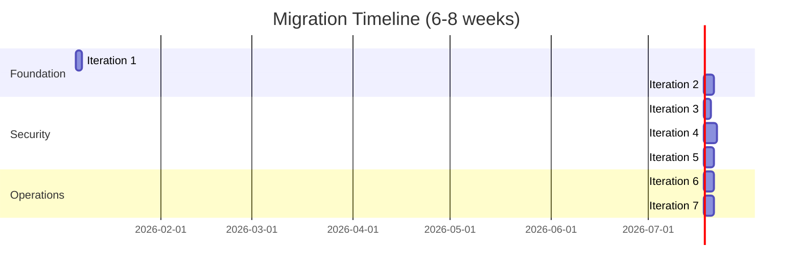

# Media Server Architecture Documentation

This directory contains comprehensive architecture documentation and implementation guides for transforming your media server from a flat, insecure architecture to a modern, hardened infrastructure.

---

## 📚 Documentation Structure

### Current Architecture
- [network-architecture.md](../network-architecture.md) - Visual diagrams of your **current** setup (broken into 7 focused diagrams)

### Proposed Architecture
- [proposed-architecture.md](proposed-architecture.md) - Complete proposed architecture with design rationale

### Implementation Plan
- [implementation/00-migration-summary.md](implementation/00-migration-summary.md) - **START HERE** - Migration overview and timeline

---

## 🎯 Quick Start

### For Understanding Your Current Setup
1. Read [network-architecture.md](../network-architecture.md)
2. Review the 7 focused diagrams showing different aspects of your current architecture

### For Planning the Migration
1. **Start with**: [00-migration-summary.md](implementation/00-migration-summary.md)
2. **Review**: [proposed-architecture.md](proposed-architecture.md) to understand the end goal
3. **Follow**: The 7 iteration guides in sequence

---

## 🚀 Implementation Iterations

Each iteration is self-contained with:
- ✅ Clear objectives
- ✅ Detailed step-by-step instructions
- ✅ Validation tests
- ✅ Rollback procedures
- ✅ Troubleshooting guides

### [Iteration 1: Network Foundation](implementation/iteration-01-network-foundation.md)
**Duration:** 1-2 days | **Risk:** Low

Create segmented Docker networks to separate services by function and security level.

**Deliverables:**
- 6 new Docker networks (DMZ, frontend, backend, download, management, security)
- All services dual-homed (old + new networks)
- Validated inter-service connectivity

---

### [Iteration 2: Port Consolidation](implementation/iteration-02-port-consolidation.md)
**Duration:** 2-3 days | **Risk:** Medium

Remove direct port mappings and route all traffic through Traefik.

**Deliverables:**
- Port exposure reduced from 15+ to 3 (80, 443, 6881)
- All services accessible only via Traefik
- Firewall rules updated
- Old media-network removed

---

### [Iteration 3: TLS & HTTPS](implementation/iteration-03-tls-https.md)
**Duration:** 1-2 days | **Risk:** Low

Enable HTTPS for all services with automated certificate management.

**Deliverables:**
- Let's Encrypt certificates for public domain
- Self-signed certificates for local services
- HTTP → HTTPS redirects enforced
- TLS 1.2+ only

---

### [Iteration 4: Authentication Layer](implementation/iteration-04-authentication.md)
**Duration:** 3-4 days | **Risk:** Medium

Deploy Authelia for centralized authentication with SSO and 2FA.

**Deliverables:**
- Authelia SSO service running
- Centralized authentication for all services
- 2FA enforced for admin services
- Fine-grained access control policies

---

### [Iteration 5: Secrets Management](implementation/iteration-05-secrets-management.md)
**Duration:** 2-3 days | **Risk:** Low

Extract secrets from .env files and implement Docker secrets.

**Deliverables:**
- All secrets moved to dedicated directory
- Docker secrets implemented
- No plaintext secrets in version control
- Secret rotation procedures documented

---

### [Iteration 6: Enhanced Monitoring](implementation/iteration-06-enhanced-monitoring.md)
**Duration:** 2-3 days | **Risk:** Low

Deploy Loki for centralized logging and create unified dashboards.

**Deliverables:**
- Loki + Promtail for log aggregation
- Unified Grafana dashboards (metrics + logs)
- Enhanced alert rules
- Log retention policies configured

---

### [Iteration 7: Infrastructure Hardening](implementation/iteration-07-infrastructure-hardening.md)
**Duration:** 2-3 days | **Risk:** Low

Implement automated backups, resource quotas, and operational excellence.

**Deliverables:**
- Automated backup system operational
- Resource limits enforced on all services
- Rate limiting configured
- Auto-healing for critical services
- Disaster recovery procedures documented

---

## 📊 Migration Overview

---

## 🎯 Expected Outcomes

### Before Migration
- ❌ 15+ exposed ports
- ❌ Flat network (no segmentation)
- ❌ Per-service authentication (inconsistent)
- ❌ HTTP only (no encryption)
- ❌ Plaintext secrets in .env
- ❌ Basic monitoring (metrics only)
- ❌ Manual backups
- ❌ No resource limits

### After Migration
- ✅ 3 exposed ports (87% reduction)
- ✅ 6 segmented networks
- ✅ Centralized SSO + 2FA
- ✅ HTTPS everywhere
- ✅ Encrypted secrets (Docker secrets)
- ✅ Comprehensive observability (metrics + logs + traces)
- ✅ Automated backups
- ✅ Resource quotas enforced
- ✅ Rate limiting + auto-healing

---

## 📈 Success Metrics

| Metric | Current | Target | Improvement |
|--------|---------|--------|-------------|
| **Exposed Ports** | 15+ | 3 | -87% attack surface |
| **Authentication** | Per-service | Centralized SSO | Unified access control |
| **Network Zones** | 1 flat | 6 segmented | Defense in depth |
| **Encryption** | Optional | Enforced | 100% coverage |
| **Secret Security** | Plaintext | Encrypted | High security |
| **Observability** | Metrics only | Metrics + Logs | Full visibility |
| **Backup Strategy** | Manual | Automated | Zero effort |
| **Resource Management** | None | Enforced limits | Predictable performance |

---

## 🛠️ Tools & Technologies

### Networking
- **Docker Bridge Networks** - Container networking
- **Traefik v3** - Reverse proxy and ingress

### Security
- **Authelia** - SSO and 2FA
- **Let's Encrypt** - TLS certificates
- **fail2ban** - Intrusion prevention
- **Docker Secrets** - Secret management

### Monitoring
- **Prometheus** - Metrics collection
- **Loki** - Log aggregation
- **Grafana** - Unified dashboards
- **Alertmanager** - Alert routing
- **cAdvisor** - Container metrics
- **Node Exporter** - Host metrics

### Infrastructure
- **Docker Compose** - Orchestration
- **Autoheal** - Container health management
- **offen/docker-volume-backup** - Automated backups

---

## 📖 Reading Order

### For Architects/Decision Makers
1. [proposed-architecture.md](proposed-architecture.md) - Understand the vision
2. [00-migration-summary.md](implementation/00-migration-summary.md) - Review timeline and risks
3. Individual iteration documents - Deep dive as needed

### For Implementation Engineers
1. [00-migration-summary.md](implementation/00-migration-summary.md) - Overall plan
2. [network-architecture.md](../network-architecture.md) - Current state analysis
3. [proposed-architecture.md](proposed-architecture.md) - Target state
4. Iteration guides (01-07) - Step-by-step implementation

### For Operators/SREs
1. [00-migration-summary.md](implementation/00-migration-summary.md) - Migration strategy
2. Iteration 6 - Monitoring setup
3. Iteration 7 - Operational procedures
4. [proposed-architecture.md](proposed-architecture.md) - Security model

---

## 🔒 Security Considerations

### Before Starting
- ✅ Backup everything
- ✅ Document current access patterns
- ✅ Plan emergency access procedures
- ✅ Notify users of changes

### During Migration
- ✅ One iteration at a time
- ✅ Validate after each step
- ✅ Keep rollback procedures ready
- ✅ Monitor for issues

### After Completion
- ✅ Security audit
- ✅ Penetration testing
- ✅ User access review
- ✅ Documentation update

---

## 🆘 Support & Troubleshooting

Each iteration document includes:
- **Validation checklists** - Ensure success
- **Troubleshooting sections** - Common issues and solutions
- **Rollback procedures** - Quick recovery
- **Post-migration tasks** - Follow-up actions

### Common Issues Across Iterations

**Network Connectivity**
- Ensure services on common networks
- Check Docker DNS resolution
- Verify Traefik service discovery

**Authentication Problems**
- Check Authelia logs
- Verify access control rules
- Test emergency bypass

**Performance Degradation**
- Review resource limits
- Check for resource contention
- Monitor metrics in Grafana

---

## 📝 Maintenance

### Daily
- Automated backups (2 AM)
- Health check monitoring
- Log aggregation

### Weekly
- Review security alerts
- Check backup success
- Resource usage analysis

### Monthly
- Security updates
- Certificate renewal verification
- Backup restoration test
- Capacity planning

### Quarterly
- Secret rotation
- Disaster recovery drill
- Architecture review
- Performance optimization

---

## 🎓 Learning Resources

### Docker Networking
- [Docker Network Documentation](https://docs.docker.com/network/)
- [Docker Security Best Practices](https://docs.docker.com/engine/security/)

### Traefik
- [Traefik Documentation](https://doc.traefik.io/traefik/)
- [Traefik & Docker](https://doc.traefik.io/traefik/providers/docker/)

### Authelia
- [Authelia Documentation](https://www.authelia.com/)
- [Integration with Traefik](https://www.authelia.com/integration/proxies/traefik/)

### Monitoring
- [Prometheus Best Practices](https://prometheus.io/docs/practices/)
- [Grafana Loki Documentation](https://grafana.com/docs/loki/latest/)

---

## 🤝 Contributing

If you make improvements to this architecture:
1. Document changes in relevant files
2. Update diagrams if architecture changes
3. Add lessons learned to iteration docs
4. Share improvements with team

---

## 📞 Getting Help

### Decision Points
Some iterations require decisions:
- Authentication strategy (who needs 2FA?)
- Backup retention policies
- Resource limit values
- Alert thresholds

### Escalation Path
1. Check iteration-specific troubleshooting
2. Review Docker/Traefik logs
3. Consult official documentation
4. Reach out to community forums

---

## ✅ Pre-flight Checklist

Before starting the migration:

- [ ] Read all documentation
- [ ] Full system backup completed
- [ ] Test environment available (optional but recommended)
- [ ] Maintenance window scheduled
- [ ] Users notified
- [ ] Emergency access documented
- [ ] Rollback procedures understood
- [ ] Team trained on new architecture

---

## 🎉 Completion

After completing all 7 iterations, you will have:

✅ **Enterprise-grade security**
✅ **Full observability**
✅ **Automated operations**
✅ **Disaster recovery ready**
✅ **Production-ready infrastructure**

**Congratulations on building a world-class media server!** 🚀

---

*Last Updated: 2026-01-04*
*Version: 1.0*
