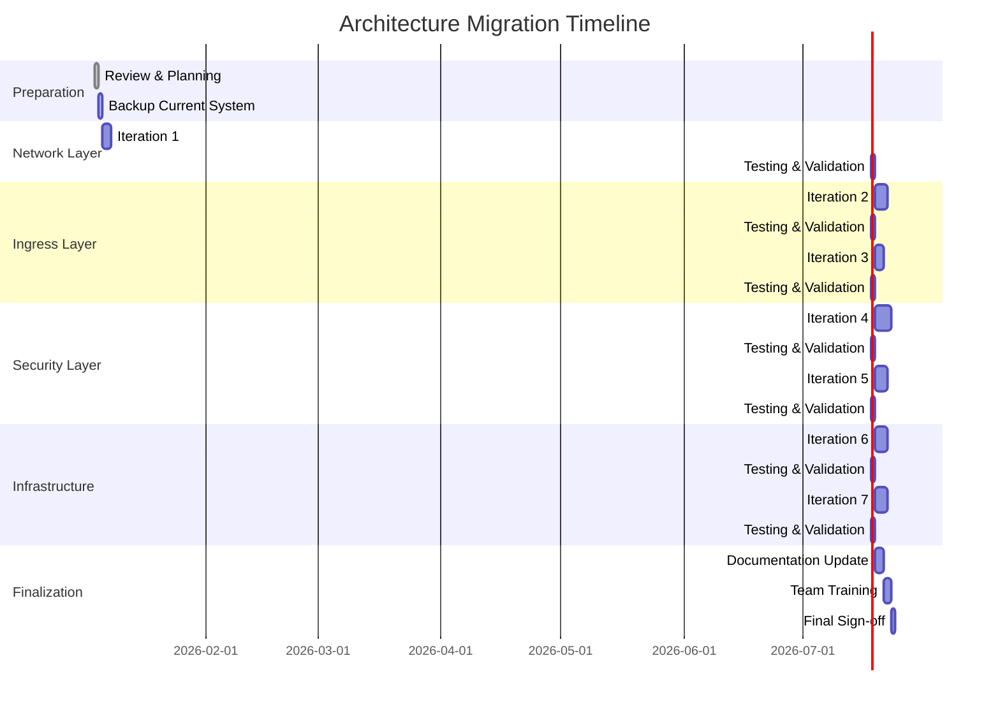
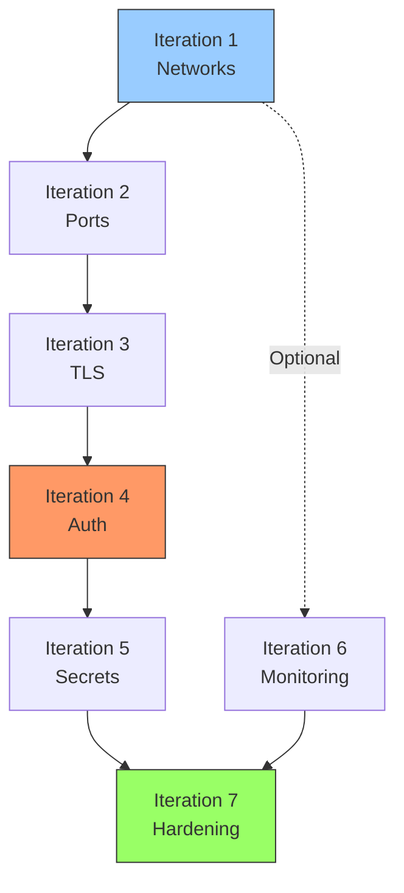

# Migration Summary: Current to Proposed Architecture

## Overview

This document outlines the complete migration path from the current flat network architecture to the proposed segmented, secure architecture.

**Total Iterations:** 7
**Estimated Timeline:** 6-8 weeks (with testing and validation)
**Risk Level:** Low to Medium (incremental changes with rollback points)

---

## Migration Strategy

### Approach: Incremental Transformation

Each iteration is designed to:
- ✅ Be independently deployable
- ✅ Have minimal service disruption
- ✅ Include rollback procedures
- ✅ Be testable and verifiable
- ✅ Build upon previous iterations

### Rollback Strategy

Each iteration includes:
1. **Pre-migration backup** of all configs
2. **Snapshot point** for quick rollback
3. **Validation tests** to verify success
4. **Rollback commands** if issues arise

---

## Migration Iterations

### Iteration 1: Network Foundation
**Status:** Not Started
**Duration:** 1-2 days
**Risk:** Low
**Downtime:** None

**Objectives:**
- Create new segmented networks
- Deploy services to multiple networks (dual-homed)
- Validate inter-service connectivity
- Keep existing media-network active

**Services Modified:** All services (network assignments only)

**Deliverables:**
- 6 new Docker networks created
- All services connected to appropriate networks
- Connectivity validation tests passed

[📄 Detailed Plan: iteration-01-network-foundation.md](iteration-01-network-foundation.md)

---

### Iteration 2: Port Consolidation
**Status:** Not Started
**Duration:** 2-3 days
**Risk:** Medium
**Downtime:** Minimal (per-service)

**Objectives:**
- Remove direct port mappings from services
- Force all traffic through Traefik
- Update firewall rules
- Reduce attack surface

**Services Modified:** All application services

**Deliverables:**
- Only ports 80 and 443 exposed on host
- All services accessible via Traefik
- Updated DNS/host file entries

[📄 Detailed Plan: iteration-02-port-consolidation.md](iteration-02-port-consolidation.md)

---

### Iteration 3: TLS & HTTPS
**Status:** Not Started
**Duration:** 1-2 days
**Risk:** Low
**Downtime:** None

**Objectives:**
- Configure Let's Encrypt in Traefik
- Enable HTTPS for all services
- Force HTTP to HTTPS redirects
- Update service URLs

**Services Modified:** Traefik configuration

**Deliverables:**
- Valid TLS certificates for all domains
- HTTPS enforced
- Automatic certificate renewal configured

[📄 Detailed Plan: iteration-03-tls-https.md](iteration-03-tls-https.md)

---

### Iteration 4: Authentication Layer (Authelia)
**Status:** Not Started
**Duration:** 3-4 days
**Risk:** Medium
**Downtime:** Minimal

**Objectives:**
- Deploy Authelia SSO service
- Configure access control rules
- Integrate with Traefik
- Enable 2FA for admin services

**Services Modified:** Traefik (middleware), All protected services

**Deliverables:**
- Authelia running and accessible
- SSO login for protected services
- 2FA enabled for admin services
- Access control rules enforced

[📄 Detailed Plan: iteration-04-authentication.md](iteration-04-authentication.md)

---

### Iteration 5: Secrets Management
**Status:** Not Started
**Duration:** 2-3 days
**Risk:** Low
**Downtime:** Per-service restart

**Objectives:**
- Extract secrets from .env files
- Implement Docker secrets
- Update service configurations
- Secure sensitive data

**Services Modified:** All services with secrets

**Deliverables:**
- Docker secrets configured
- Secrets removed from version control
- Services using secret files
- .env.example template created

[📄 Detailed Plan: iteration-05-secrets-management.md](iteration-05-secrets-management.md)

---

### Iteration 6: Enhanced Monitoring
**Status:** Not Started
**Duration:** 2-3 days
**Risk:** Low
**Downtime:** None

**Objectives:**
- Deploy Loki for log aggregation
- Deploy Promtail for log collection
- Configure Grafana dashboards
- Enhance alerting rules

**Services Added:** Loki, Promtail

**Deliverables:**
- Centralized logging operational
- Unified Grafana dashboards
- Enhanced alert rules
- Log retention policies configured

[📄 Detailed Plan: iteration-06-enhanced-monitoring.md](iteration-06-enhanced-monitoring.md)

---

### Iteration 7: Infrastructure Hardening
**Status:** Not Started
**Duration:** 2-3 days
**Risk:** Low
**Downtime:** None

**Objectives:**
- Implement automated backups
- Add resource quotas enforcement
- Configure rate limiting
- Implement health-based auto-scaling (if needed)

**Services Added:** Backup service

**Deliverables:**
- Automated backup system operational
- Resource limits enforced
- Rate limiting configured
- Backup restoration tested

[📄 Detailed Plan: iteration-07-infrastructure-hardening.md](iteration-07-infrastructure-hardening.md)

---

## Migration Timeline



---

## Risk Assessment

### Overall Risk: Low-Medium

| Iteration | Risk Level | Impact if Failed | Mitigation |
|-----------|------------|------------------|------------|
| 1. Networks | Low | Service connectivity issues | Dual-homed approach, keep old network |
| 2. Ports | Medium | Services unreachable | Per-service migration, rollback available |
| 3. TLS | Low | Certificate errors | Staging certs first, DNS validation |
| 4. Authelia | Medium | Access locked out | Bypass rules, emergency access |
| 5. Secrets | Low | Service start failures | Secret validation, gradual rollout |
| 6. Monitoring | Low | No logs/metrics | Existing monitoring continues |
| 7. Hardening | Low | Resource constraints | Conservative limits, monitoring |

---

## Prerequisites

### Before Starting Migration

1. **Full System Backup**
   ```bash
   ./scripts/backup-all.sh
   ```

2. **Document Current State**
   - Current network configuration
   - Port mappings
   - Service dependencies
   - Access patterns

3. **Prepare Test Environment** (Optional but Recommended)
   - Clone production config
   - Test migration in isolated environment
   - Validate rollback procedures

4. **Communication Plan**
   - Notify users of planned changes
   - Set maintenance windows
   - Prepare status updates

5. **Emergency Access**
   - Ensure console/SSH access
   - Have rollback commands ready
   - Keep current credentials accessible

---

## Success Criteria

### Per Iteration
- ✅ All services start successfully
- ✅ Service-to-service connectivity works
- ✅ External access functions correctly
- ✅ No degradation in performance
- ✅ Validation tests pass
- ✅ Rollback tested (optional)

### Overall Migration
- ✅ All 7 iterations completed
- ✅ Zero extended downtime
- ✅ Enhanced security posture
- ✅ Improved observability
- ✅ Documentation updated
- ✅ Team trained on new architecture

---

## Testing Strategy

### Per-Iteration Testing

1. **Smoke Tests**
   - Services start without errors
   - Health checks pass
   - Basic functionality works

2. **Integration Tests**
   - Service-to-service communication
   - End-to-end workflows
   - External access paths

3. **Performance Tests**
   - Response time benchmarks
   - Resource utilization
   - Network throughput

4. **Security Tests**
   - Port scans
   - Authentication flows
   - Access control validation

### Validation Checklist

Each iteration includes a validation checklist:
- [ ] Pre-migration backup completed
- [ ] Changes applied successfully
- [ ] Services restarted cleanly
- [ ] Health checks passing
- [ ] Connectivity verified
- [ ] User access tested
- [ ] Performance benchmarked
- [ ] Rollback procedure documented
- [ ] Changes committed to version control

---

## Rollback Procedures

### General Rollback Process

1. **Stop affected services**
   ```bash
   docker-compose stop <service>
   ```

2. **Restore configuration**
   ```bash
   cp -r backups/pre-iteration-X/* .
   ```

3. **Restart services**
   ```bash
   docker-compose up -d
   ```

4. **Validate restoration**
   ```bash
   ./scripts/validate-system.sh
   ```

### Per-Iteration Rollback

Each iteration document includes specific rollback commands and procedures.

---

## Communication Templates

### Pre-Migration Notification

```
Subject: Planned Maintenance - Media Server Architecture Upgrade

The media server will undergo a series of planned upgrades over the next
6-8 weeks to improve security, reliability, and performance.

Expected Impact:
- Minimal downtime (< 5 minutes per change)
- Service URLs may change (bookmarks update required)
- New authentication system (SSO login)

Timeline: [Start Date] to [End Date]

Questions? Contact: [Admin Contact]
```

### Post-Iteration Update

```
Subject: Iteration [X] Complete - [Iteration Name]

✅ Successfully completed: [Iteration Name]
⏱️ Downtime: [Actual downtime]
🔄 Changes:
  - [Change 1]
  - [Change 2]

Next Steps: [Next Iteration Name] scheduled for [Date]

Issues? Report to: [Admin Contact]
```

---

## Monitoring During Migration

### Key Metrics to Watch

1. **Service Health**
   - Container status
   - Health check results
   - Restart counts

2. **Performance**
   - Response times
   - CPU/Memory usage
   - Network throughput

3. **Errors**
   - Application logs
   - Docker logs
   - Traefik access logs

### Monitoring Dashboard

Create a dedicated Grafana dashboard for migration monitoring:
- Service health status
- Error rates
- Response time trends
- Resource utilization

---

## Post-Migration Tasks

### Immediate (Day 1)
- [ ] Validate all services operational
- [ ] Confirm user access working
- [ ] Monitor for errors/issues
- [ ] Update documentation

### Short-term (Week 1)
- [ ] Performance benchmarking
- [ ] User feedback collection
- [ ] Fine-tune configurations
- [ ] Security audit

### Long-term (Month 1)
- [ ] Review monitoring data
- [ ] Optimize resource allocation
- [ ] Plan future improvements
- [ ] Team retrospective

---

## Dependencies Between Iterations



**Critical Path:** I1 → I2 → I3 → I4 → I5 → I7
**Parallel Option:** I6 can start after I1 completes

---

## Resource Requirements

### Time Investment
- **Planning:** 1-2 days
- **Execution:** 20-25 days (spread over 6-8 weeks)
- **Testing:** 7 days (1 day per iteration)
- **Documentation:** 2-3 days

**Total:** ~30-35 days of effort

### Personnel
- **Required:** 1 experienced DevOps/SysAdmin
- **Recommended:** 2 people (primary + backup)
- **Stakeholders:** Service owners, end users

### Infrastructure
- **Test Environment:** Optional but recommended
- **Backup Storage:** ~50GB for config backups
- **Temporary Resources:** Minimal (running both old and new networks temporarily)

---

## Iteration Documents

Each iteration has a detailed implementation document:

1. [Iteration 1: Network Foundation](iteration-01-network-foundation.md)
2. [Iteration 2: Port Consolidation](iteration-02-port-consolidation.md)
3. [Iteration 3: TLS & HTTPS](iteration-03-tls-https.md)
4. [Iteration 4: Authentication Layer](iteration-04-authentication.md)
5. [Iteration 5: Secrets Management](iteration-05-secrets-management.md)
6. [Iteration 6: Enhanced Monitoring](iteration-06-enhanced-monitoring.md)
7. [Iteration 7: Infrastructure Hardening](iteration-07-infrastructure-hardening.md)

---

## Questions & Support

### Decision Points

Some iterations may require decisions:
- Which services require 2FA?
- Backup retention policies?
- Resource limit values?
- Alert notification channels?

### Getting Help

If you encounter issues:
1. Check iteration-specific troubleshooting section
2. Review rollback procedure
3. Consult Docker/Traefik documentation
4. Reach out to community forums

---

## Success Metrics

### Before Migration
- **Attack Surface:** 15+ exposed ports
- **Authentication:** Per-service, inconsistent
- **Network Segmentation:** None (flat network)
- **Secrets:** Plaintext in .env
- **Observability:** Metrics only

### After Migration
- **Attack Surface:** 2 exposed ports (80, 443)
- **Authentication:** Centralized SSO with 2FA
- **Network Segmentation:** 6 isolated networks
- **Secrets:** Docker secrets, encrypted
- **Observability:** Metrics + Logs + Traces

**Security Improvement:** ~85% reduction in attack surface
**Operational Improvement:** Centralized authentication and monitoring
**Compliance:** Better alignment with security best practices

---

## Next Steps

1. **Review this summary** and all iteration documents
2. **Schedule iterations** based on your availability
3. **Create backups** of current system
4. **Start with Iteration 1** when ready
5. **Follow validation procedures** after each iteration

**Ready to begin?** → [Start Iteration 1](iteration-01-network-foundation.md)
