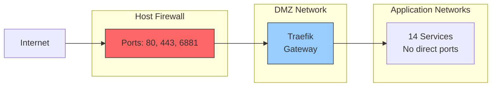

# Iteration 2: Port Consolidation

**Status:** Not Started
**Duration:** 2-3 days
**Risk Level:** Medium
**Downtime:** Minimal (per-service)
**Dependencies:** Iteration 1 completed

---

## Objectives

1. Remove direct port mappings from application services
2. Force all traffic through Traefik reverse proxy
3. Update firewall rules to only allow ports 80 and 443
4. Reduce attack surface from 15+ ports to 2 ports
5. Remove old `media-network` after validation

---

## Pre-Migration Checklist

- [ ] Iteration 1 validated and stable for 3+ days
- [ ] Full system backup
  ```bash
  ./scripts/backup-all.sh iter2-pre
  ```
- [ ] Document current port mappings
  ```bash
  docker-compose ps | grep -E ":[0-9]+->" > backups/ports-before.txt
  ```
- [ ] Test Traefik routing for all services
  ```bash
  curl -I http://jellyfin.lan
  curl -I http://jellyseerr.lan
  # ... test all services
  ```
- [ ] Update DNS/hosts file if needed
- [ ] Notify users of upcoming URL changes
- [ ] Create rollback snapshot
  ```bash
  cp -r */docker-compose.yml backups/iter2-pre/
  ```

---

## Current Port Mappings

| Service | Current Ports | After Iteration 2 | Access Method |
|---------|---------------|-------------------|---------------|
| **Traefik** | 80, 8090 | 80, 443 | Direct (keep) |
| Jellyfin | 8096, 8920, 7359, 1900 | None | Via Traefik |
| Jellyseerr | 5055 | None | Via Traefik |
| Sonarr | 8989 | None | Via Traefik |
| Radarr | 7878 | None | Via Traefik |
| Prowlarr | 9696 | None | Via Traefik |
| Bazarr | 6767 | None | Via Traefik |
| Gluetun/qBittorrent | 8080, 6881 | 6881 (torrent only) | Via Traefik for WebUI |
| Prometheus | 9090 | None | Via Traefik |
| Grafana | 3001 | None | Via Traefik |
| cAdvisor | 8081 | None | Via Traefik |
| Node Exporter | 9100 | None | Via Traefik |
| Alertmanager | 9093 | None | Via Traefik |
| Dozzle | 9999 | None | Via Traefik |
| Web UI | 3000 | None | Via Traefik |

**Ports to Keep:**
- `80` - HTTP (redirects to HTTPS)
- `443` - HTTPS (added in Iteration 3)
- `6881/tcp` and `6881/udp` - Torrent traffic (must be exposed)

**Total Reduction:** 15+ ports → 3 ports (87% reduction)

---

## Service Configuration Changes

### Traefik (traefik/docker-compose.yml)

**Before:**
```yaml
services:
  traefik:
    ports:
      - "80:80"
      - "8090:8080"  # Dashboard
```

**After:**
```yaml
services:
  traefik:
    ports:
      - "80:80"       # HTTP entry point
      - "443:443"     # HTTPS entry point (for Iteration 3)
      # Remove direct dashboard port, access via Traefik routing
    labels:
      # Dashboard accessible via Traefik
      - "traefik.http.routers.traefik-dashboard.rule=Host(`traefik${DOMAIN_SUFFIX:-.lan}`)"
      - "traefik.http.routers.traefik-dashboard.entrypoints=web"
      - "traefik.http.routers.traefik-dashboard.service=api@internal"
```

### Jellyfin (jellyfin/docker-compose.yml)

**Before:**
```yaml
services:
  jellyfin:
    ports:
      - "8096:8096"
      - "8920:8920"
      - "7359:7359/udp"
      - "1900:1900/udp"
```

**After:**
```yaml
services:
  jellyfin:
    # Remove all port mappings
    # ports: []  # Commented out or removed
    # Access via Traefik only: http://jellyfin.lan
```

**Note:** DLNA discovery (1900/udp) and auto-discovery (7359/udp) will not work. If needed, these can be re-enabled with network_mode: host (not recommended).

### Jellyseerr (jellyseerr/docker-compose.yml)

**Before:**
```yaml
services:
  jellyseerr:
    ports:
      - "5055:5055"
```

**After:**
```yaml
services:
  jellyseerr:
    # Remove port mapping
    # Access via Traefik: http://jellyseerr.lan
```

### Servarr Services (servarr/docker-compose.yml)

**Before:**
```yaml
services:
  sonarr:
    ports:
      - "8989:8989"

  radarr:
    ports:
      - "7878:7878"

  prowlarr:
    ports:
      - "9696:9696"

  bazarr:
    ports:
      - "6767:6767"
```

**After:**
```yaml
services:
  sonarr:
    # Remove port mapping
    # Access via Traefik: http://sonarr.lan

  radarr:
    # Remove port mapping
    # Access via Traefik: http://radarr.lan

  prowlarr:
    # Remove port mapping
    # Access via Traefik: http://prowlarr.lan

  bazarr:
    # Remove port mapping
    # Access via Traefik: http://bazarr.lan
```

### Download Services (qbittorrent/docker-compose.yml)

**Before:**
```yaml
services:
  gluetun:
    ports:
      - "8080:8080"     # qBittorrent WebUI
      - "6881:6881"     # Torrent traffic
      - "6881:6881/udp"
```

**After:**
```yaml
services:
  gluetun:
    ports:
      # Remove WebUI port, access via Traefik
      - "6881:6881"     # Keep for torrent traffic
      - "6881:6881/udp"
    # WebUI access via Traefik: http://qbittorrent.lan
```

### Monitoring Services (monitoring/docker-compose.yml)

**Before:**
```yaml
services:
  prometheus:
    ports:
      - "9090:9090"

  grafana:
    ports:
      - "3001:3000"

  cadvisor:
    ports:
      - "8081:8080"

  node-exporter:
    ports:
      - "9100:9100"

  alertmanager:
    ports:
      - "9093:9093"
```

**After:**
```yaml
services:
  prometheus:
    # Remove port mapping
    # Access via Traefik: http://prometheus.lan

  grafana:
    # Remove port mapping
    # Access via Traefik: http://grafana.lan

  cadvisor:
    # Remove port mapping
    # Access via Traefik: http://cadvisor.lan

  node-exporter:
    # Remove port mapping (internal metrics only)
    # Scraped by Prometheus internally

  alertmanager:
    # Remove port mapping
    # Access via Traefik: http://alertmanager.lan
```

### Dozzle (dozzle/docker-compose.yml)

**Before:**
```yaml
services:
  dozzle:
    ports:
      - "9999:8080"
```

**After:**
```yaml
services:
  dozzle:
    # Remove port mapping
    # Access via Traefik: http://dozzle.lan
```

### Web UI (web-ui/docker-compose.yml)

**Before:**
```yaml
services:
  web-ui:
    ports:
      - "3000:3000"
```

**After:**
```yaml
services:
  web-ui:
    # Remove port mapping
    # Access via Traefik: http://dashboard.lan or http://otterammo.xyz
```

---

## Traefik Router Verification

Ensure all services have proper Traefik labels:

```yaml
# Example for each service
labels:
  - "traefik.enable=true"
  - "traefik.http.routers.<service>.rule=Host(`<service>${DOMAIN_SUFFIX:-.lan}`)"
  - "traefik.http.routers.<service>.entrypoints=web"
  - "traefik.http.services.<service>.loadbalancer.server.port=<internal_port>"
```

**Services to verify:**
- [x] traefik
- [x] jellyfin
- [x] jellyseerr
- [x] sonarr
- [x] radarr
- [x] prowlarr
- [x] bazarr
- [x] gluetun (qBittorrent)
- [x] prometheus
- [x] grafana
- [x] cadvisor
- [x] alertmanager
- [x] dozzle
- [x] web-ui

---

## Implementation Steps

### Step 1: Backup and Validate

```bash
cd /home/otterammo/media

# Backup current configuration
mkdir -p backups/iter2-pre
cp -r */docker-compose.yml backups/iter2-pre/
cp docker-compose.yml backups/iter2-pre/

# Document current state
docker-compose ps > backups/iter2-pre/services.txt
docker ps --format "table {{.Names}}\t{{.Ports}}" > backups/iter2-pre/ports.txt
```

### Step 2: Update Traefik Configuration

```bash
# Edit traefik/docker-compose.yml
nano traefik/docker-compose.yml

# Changes:
# 1. Remove port 8090:8080
# 2. Add port 443:443
# 3. Update dashboard labels

# Restart Traefik
docker-compose up -d traefik

# Verify Traefik is healthy
docker-compose ps traefik
curl -I http://traefik.lan
```

### Step 3: Remove Ports Per Service (One at a Time)

**Order of migration (least critical to most critical):**

```bash
# 1. Monitoring services (lowest user impact)
nano monitoring/docker-compose.yml
# Remove ports from: cadvisor, node-exporter, alertmanager, prometheus
docker-compose up -d cadvisor node-exporter alertmanager prometheus

# Test access via Traefik
curl -I http://prometheus.lan
curl -I http://cadvisor.lan
curl -I http://alertmanager.lan

# 2. Management tools
nano dozzle/docker-compose.yml
# Remove port 9999:8080
docker-compose up -d dozzle

# Test
curl -I http://dozzle.lan

# 3. Automation services
nano servarr/docker-compose.yml
# Remove ports from: sonarr, radarr, prowlarr, bazarr
docker-compose up -d sonarr radarr prowlarr bazarr

# Test
curl -I http://sonarr.lan
curl -I http://radarr.lan
curl -I http://prowlarr.lan
curl -I http://bazarr.lan

# 4. Download services
nano qbittorrent/docker-compose.yml
# Remove port 8080:8080, keep 6881
docker-compose up -d gluetun

# Test
curl -I http://qbittorrent.lan

# 5. User-facing services
nano jellyseerr/docker-compose.yml
# Remove port 5055:5055
docker-compose up -d jellyseerr

# Test
curl -I http://jellyseerr.lan

nano jellyfin/docker-compose.yml
# Remove ports: 8096, 8920, 7359, 1900
docker-compose up -d jellyfin

# Test
curl -I http://jellyfin.lan
# Test streaming in browser

# 6. Web UI
nano web-ui/docker-compose.yml
# Remove port 3000:3000
docker-compose up -d web-ui

# Test
curl -I http://dashboard.lan

# 7. Grafana (last, so we can monitor throughout)
nano monitoring/docker-compose.yml
# Remove port 3001:3000
docker-compose up -d grafana

# Test
curl -I http://grafana.lan
```

### Step 4: Update /etc/hosts or DNS

If using local DNS resolution, update entries:

```bash
# Edit /etc/hosts on client machines
sudo nano /etc/hosts

# Add/update entries to use Traefik
192.168.86.111  jellyfin.lan
192.168.86.111  jellyseerr.lan
192.168.86.111  sonarr.lan
192.168.86.111  radarr.lan
192.168.86.111  prowlarr.lan
192.168.86.111  bazarr.lan
192.168.86.111  qbittorrent.lan
192.168.86.111  prometheus.lan
192.168.86.111  grafana.lan
192.168.86.111  cadvisor.lan
192.168.86.111  alertmanager.lan
192.168.86.111  dozzle.lan
192.168.86.111  dashboard.lan
192.168.86.111  traefik.lan
```

### Step 5: Update Firewall Rules

```bash
# Check current firewall rules
sudo iptables -L -n -v | grep -E "(80|443|8096|5055)"

# If using ufw
sudo ufw status numbered

# Remove old port rules
sudo ufw delete allow 8096
sudo ufw delete allow 5055
sudo ufw delete allow 8989
sudo ufw delete allow 7878
sudo ufw delete allow 9696
sudo ufw delete allow 6767
sudo ufw delete allow 8080
sudo ufw delete allow 9090
sudo ufw delete allow 3001
sudo ufw delete allow 8081
sudo ufw delete allow 9100
sudo ufw delete allow 9093
sudo ufw delete allow 9999
sudo ufw delete allow 3000
sudo ufw delete allow 8090

# Ensure required ports are allowed
sudo ufw allow 80/tcp
sudo ufw allow 443/tcp
sudo ufw allow 6881/tcp
sudo ufw allow 6881/udp

# Verify
sudo ufw status
```

### Step 6: Remove media-network

Now that all services are on new networks, remove the old one:

```bash
# Remove media-network from all service definitions
find . -name "docker-compose.yml" -exec sed -i '/- media-network/d' {} \;

# Remove from networks.yml
nano networks.yml
# Delete media-network definition

# Restart all services
docker-compose down
docker-compose up -d

# Remove old network
docker network rm media-network

# Verify it's gone
docker network ls | grep media-network
```

---

## Validation Tests

### Test 1: Service Accessibility

```bash
# Test all services via Traefik
services=(
    "jellyfin.lan"
    "jellyseerr.lan"
    "sonarr.lan"
    "radarr.lan"
    "prowlarr.lan"
    "bazarr.lan"
    "qbittorrent.lan"
    "prometheus.lan"
    "grafana.lan"
    "cadvisor.lan"
    "alertmanager.lan"
    "dozzle.lan"
    "dashboard.lan"
    "traefik.lan"
)

for service in "${services[@]}"; do
    echo "Testing $service..."
    curl -s -o /dev/null -w "%{http_code}" http://$service
    echo ""
done
```

### Test 2: Direct Port Access (Should Fail)

```bash
# These should all fail or refuse connection
curl http://localhost:8096  # Jellyfin - should fail
curl http://localhost:5055  # Jellyseerr - should fail
curl http://localhost:8989  # Sonarr - should fail
curl http://localhost:9090  # Prometheus - should fail

# These should still work
curl http://localhost:80    # Traefik - should work
```

### Test 3: External Port Scan

```bash
# Install nmap if not available
sudo apt install nmap

# Scan from external machine
nmap -p 1-10000 192.168.86.111

# Should only show:
# 80/tcp   open  http
# 443/tcp  open  https
# 6881/tcp open  bittorrent
```

### Test 4: Application Workflows

**Streaming Test:**
1. Open browser to http://jellyfin.lan
2. Log in
3. Play a movie/show
4. Verify streaming works

**Request Test:**
1. Open http://jellyseerr.lan
2. Request a TV show
3. Check http://sonarr.lan for request
4. Verify workflow completes

**Download Test:**
1. Manually add torrent to http://qbittorrent.lan
2. Verify download starts
3. Check VPN connection in Gluetun logs

**Monitoring Test:**
1. Open http://grafana.lan
2. Check dashboards load
3. Verify metrics are current
4. Open http://dozzle.lan
5. Verify logs streaming

---

## Validation Checklist

- [ ] All services accessible via Traefik URLs
- [ ] No services accessible via direct ports (except Traefik)
- [ ] Port scan shows only 80, 443, 6881
- [ ] Firewall rules updated
- [ ] Jellyfin streaming functional
- [ ] Jellyseerr requests work
- [ ] Sonarr/Radarr automation functional
- [ ] qBittorrent downloads via VPN
- [ ] Prometheus collecting metrics
- [ ] Grafana dashboards working
- [ ] Dozzle showing logs
- [ ] All health checks passing
- [ ] media-network removed
- [ ] No errors in Docker logs
- [ ] User bookmarks updated
- [ ] Documentation updated

---

## Troubleshooting

### Issue: Service not accessible via Traefik

**Symptoms:**
```
curl: (7) Failed to connect to <service>.lan port 80: Connection refused
```

**Solution:**
```bash
# Check Traefik logs
docker-compose logs traefik | grep <service>

# Verify Traefik labels
docker inspect <service> | jq '.[0].Config.Labels'

# Ensure service is on a network Traefik can reach
docker network inspect frontend-net

# Restart Traefik
docker-compose restart traefik
```

### Issue: Traefik returns 502 Bad Gateway

**Symptoms:**
HTTP 502 error when accessing service

**Solution:**
```bash
# Check if service is running
docker-compose ps <service>

# Check service health
docker inspect <service> | jq '.[0].State.Health'

# Verify internal port in Traefik labels
docker inspect <service> | jq '.[0].Config.Labels' | grep loadbalancer.server.port

# Check service logs
docker-compose logs <service>
```

### Issue: Can't access Traefik dashboard

**Symptoms:**
404 Not Found when accessing http://traefik.lan

**Solution:**
```bash
# Verify API is enabled
docker-compose logs traefik | grep "api.dashboard=true"

# Check labels
docker inspect traefik | jq '.[0].Config.Labels'

# Should have:
# "traefik.http.routers.traefik-dashboard.service=api@internal"
```

### Issue: Jellyfin DLNA/Auto-discovery not working

**Symptoms:**
Jellyfin not discovered by DLNA clients

**Solution:**
DLNA requires UDP ports 1900 and 7359. Options:

1. **Re-enable specific ports** (less secure):
   ```yaml
   jellyfin:
     ports:
       - "1900:1900/udp"
       - "7359:7359/udp"
   ```

2. **Use host networking** (not recommended):
   ```yaml
   jellyfin:
     network_mode: host
   ```

3. **Manual client configuration** (recommended):
   Configure DLNA clients to use http://jellyfin.lan:80 directly

---

## Rollback Procedure

### Full Rollback

```bash
# Stop all services
docker-compose down

# Restore all configurations
cp -r backups/iter2-pre/*/docker-compose.yml */
cp backups/iter2-pre/docker-compose.yml .

# Restart services
docker-compose up -d

# Restore firewall rules
sudo ufw allow 8096
sudo ufw allow 5055
# ... restore other ports

# Verify
docker-compose ps
```

### Partial Rollback (Keep Some Changes)

```bash
# Restore only specific services
cp backups/iter2-pre/jellyfin/docker-compose.yml jellyfin/
docker-compose up -d jellyfin
```

---

## Post-Migration Tasks

### Immediate
- [ ] Monitor access logs for 404s
  ```bash
  docker-compose logs -f traefik | grep " 404 "
  ```
- [ ] Update user documentation with new URLs
- [ ] Update browser bookmarks
- [ ] Test from different devices (desktop, mobile, TV)

### Within 24 Hours
- [ ] Port scan from external network
- [ ] Security audit of exposed ports
- [ ] Performance benchmarking
- [ ] Collect user feedback

### Within 1 Week
- [ ] Remove old DNS entries
- [ ] Update monitoring alerts for new URLs
- [ ] Prepare for Iteration 3 (TLS/HTTPS)

---

## Success Criteria

✅ **Iteration 2 is successful if:**

1. Only 3 ports exposed (80, 443, 6881)
2. All services accessible via Traefik
3. No direct service port access possible
4. All workflows functional
5. Zero extended downtime
6. Firewall rules updated
7. media-network removed
8. Performance unchanged

---

## Updated Architecture Diagram



---

## Next Steps

Once Iteration 2 is validated:

1. **Monitor for 3-5 days** to ensure stability
2. **Security audit** to verify port exposure reduced
3. **Update documentation** with new access methods
4. **Prepare for Iteration 3**: TLS & HTTPS
   - Obtain domain name (if needed)
   - Plan Let's Encrypt integration
   - Prepare certificate management

**Ready for next iteration?** → [Iteration 3: TLS & HTTPS](iteration-03-tls-https.md)
