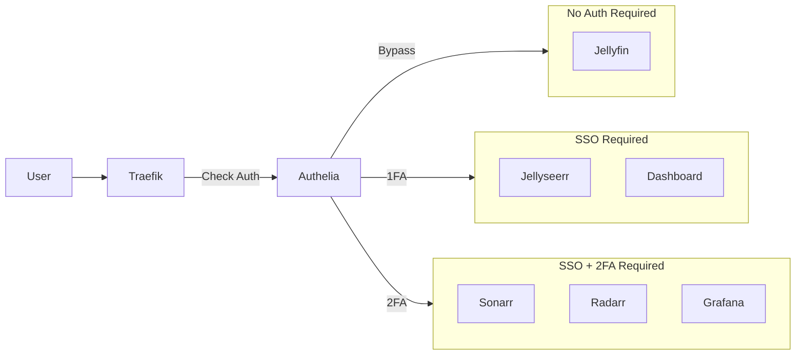

# Iteration 4: Authentication Layer (Authelia)

**Status:** Not Started
**Duration:** 3-4 days
**Risk Level:** Medium
**Downtime:** Minimal
**Dependencies:** Iteration 3 completed

---

## Objectives

1. Deploy Authelia SSO service
2. Configure user authentication (username/password)
3. Enable 2FA (TOTP) for admin services
4. Integrate Authelia with Traefik
5. Implement access control rules (public/protected/admin)
6. Ensure emergency access bypass

---

## Pre-Migration Checklist

- [ ] Iteration 3 validated and stable
- [ ] HTTPS working for all services
- [ ] Decide on user accounts and access levels
- [ ] Have authenticator app ready (Google Authenticator, Authy, etc.)
- [ ] Document emergency access procedure

---

## Authelia Overview

Authelia provides:
- **Single Sign-On (SSO)**: One login for all services
- **Two-Factor Authentication (2FA)**: TOTP, WebAuthn, Duo
- **Access Control**: Fine-grained policies per service
- **Session Management**: Configurable timeouts
- **LDAP/File-based users**: Flexible user management

---

## Architecture with Authelia



---

## Authelia Service Definition

Create `authelia/docker-compose.yml`:

```yaml
services:
  authelia:
    image: authelia/authelia:latest
    container_name: authelia
    restart: unless-stopped

    volumes:
      - ./config:/config
      - ./data:/data

    environment:
      - TZ=${TZ:-UTC}
      - AUTHELIA_JWT_SECRET_FILE=/data/secrets/jwt_secret
      - AUTHELIA_SESSION_SECRET_FILE=/data/secrets/session_secret
      - AUTHELIA_STORAGE_ENCRYPTION_KEY_FILE=/data/secrets/storage_encryption_key

    networks:
      - security-net
      - frontend-net

    labels:
      - "traefik.enable=true"
      - "traefik.docker.network=frontend-net"

      # Auth portal
      - "traefik.http.routers.authelia.rule=Host(`auth${DOMAIN_SUFFIX:-.lan}`)"
      - "traefik.http.routers.authelia.entrypoints=websecure"
      - "traefik.http.routers.authelia.tls=true"
      - "traefik.http.services.authelia.loadbalancer.server.port=9091"

      # Forward auth middleware
      - "traefik.http.middlewares.authelia.forwardAuth.address=http://authelia:9091/api/verify?rd=https://auth${DOMAIN_SUFFIX:-.lan}"
      - "traefik.http.middlewares.authelia.forwardAuth.trustForwardHeader=true"
      - "traefik.http.middlewares.authelia.forwardAuth.authResponseHeaders=Remote-User,Remote-Groups,Remote-Name,Remote-Email"

    healthcheck:
      test: ["CMD", "wget", "--no-verbose", "--tries=1", "--spider", "http://localhost:9091/api/health"]
      interval: 30s
      timeout: 10s
      retries: 3
      start_period: 30s
```

---

## Authelia Configuration

### Generate Secrets

```bash
cd /home/otterammo/media/authelia
mkdir -p data/secrets config

# Generate random secrets
openssl rand -base64 64 > data/secrets/jwt_secret
openssl rand -base64 64 > data/secrets/session_secret
openssl rand -base64 64 > data/secrets/storage_encryption_key

# Secure permissions
chmod 600 data/secrets/*
```

### Main Configuration File

Create `authelia/config/configuration.yml`:

```yaml
---
###############################################################
#                   Authelia Configuration                    #
###############################################################

theme: dark
default_2fa_method: "totp"

server:
  host: 0.0.0.0
  port: 9091
  path: ""
  asset_path: /config/assets/

log:
  level: info
  format: text
  file_path: /data/authelia.log
  keep_stdout: true

totp:
  disable: false
  issuer: media.lan
  algorithm: sha1
  digits: 6
  period: 30
  skew: 1

authentication_backend:
  password_reset:
    disable: false
  refresh_interval: 5m

  file:
    path: /config/users.yml
    watch: true
    password:
      algorithm: argon2
      argon2:
        variant: argon2id
        iterations: 3
        memory: 65536
        parallelism: 4
        key_length: 32
        salt_length: 16

access_control:
  default_policy: deny

  rules:
    # Public services - no authentication
    - domain:
        - "jellyfin.lan"
        - "otterammo.xyz"
      policy: bypass

    # Protected services - single factor (username/password)
    - domain:
        - "jellyseerr.lan"
        - "dashboard.lan"
      policy: one_factor

    # Admin services - two factor (username/password + TOTP)
    - domain:
        - "sonarr.lan"
        - "radarr.lan"
        - "prowlarr.lan"
        - "bazarr.lan"
        - "qbittorrent.lan"
        - "prometheus.lan"
        - "grafana.lan"
        - "cadvisor.lan"
        - "alertmanager.lan"
        - "traefik.lan"
        - "dozzle.lan"
      policy: two_factor

    # Auth portal itself - bypass
    - domain:
        - "auth.lan"
      policy: bypass

session:
  name: authelia_session
  domain: local  # Should match your DOMAIN_SUFFIX
  same_site: lax
  expiration: 1h
  inactivity: 15m
  remember_me_duration: 1M

  redis:
    host: redis
    port: 6379
    database_index: 0

regulation:
  max_retries: 5
  find_time: 2m
  ban_time: 10m

storage:
  local:
    path: /data/db.sqlite3

notifier:
  disable_startup_check: false

  # File-based notifications (for development)
  filesystem:
    filename: /data/notifications.txt

  # SMTP notifications (for production)
  # smtp:
  #   host: ${SMTP_HOST}
  #   port: ${SMTP_PORT}
  #   username: ${SMTP_USER}
  #   password: ${SMTP_PASSWORD}
  #   sender: authelia@otterammo.xyz
  #   subject: "[Media Server] {title}"
  #   startup_check_address: test@otterammo.xyz
  #   disable_require_tls: false
  #   disable_html_emails: false
```

### User Database

Create `authelia/config/users.yml`:

```yaml
---
###############################################################
#                        Users Database                       #
###############################################################

users:
  admin:
    displayname: "Admin User"
    password: "$argon2id$v=19$m=65536,t=3,p=4$REPLACE_WITH_HASH"  # Change this!
    email: admin@otterammo.xyz
    groups:
      - admins
      - users

  user:
    displayname: "Regular User"
    password: "$argon2id$v=19$m=65536,t=3,p=4$REPLACE_WITH_HASH"  # Change this!
    email: user@otterammo.xyz
    groups:
      - users
```

### Generate Password Hashes

```bash
# Install Authelia CLI (or use Docker)
docker run authelia/authelia:latest authelia crypto hash generate argon2 --password 'YourPasswordHere'

# Copy the hash and update users.yml
```

---

## Redis for Session Storage

Add Redis to `authelia/docker-compose.yml`:

```yaml
services:
  authelia:
    # ... (as defined above)
    depends_on:
      - redis

  redis:
    image: redis:alpine
    container_name: authelia-redis
    restart: unless-stopped

    volumes:
      - ./redis-data:/data

    networks:
      - security-net

    command: redis-server --save 60 1 --loglevel warning

    healthcheck:
      test: ["CMD", "redis-cli", "ping"]
      interval: 30s
      timeout: 10s
      retries: 3
```

---

## Update docker-compose.yml

Add Authelia to main compose file:

```yaml
# docker-compose.yml
include:
  - authelia/docker-compose.yml  # ADD THIS LINE
  - cloudflared/docker-compose.yml
  - dozzle/docker-compose.yml
  - fail2ban/docker-compose.yml
  # ... rest of includes
```

---

## Integrate with Traefik

### Update Service Labels

For services requiring authentication, add Authelia middleware:

#### Protected Services (Single Factor)

**Jellyseerr:**
```yaml
labels:
  - "traefik.enable=true"
  - "traefik.http.routers.jellyseerr.rule=Host(`jellyseerr.lan`)"
  - "traefik.http.routers.jellyseerr.entrypoints=websecure"
  - "traefik.http.routers.jellyseerr.tls=true"
  - "traefik.http.routers.jellyseerr.middlewares=authelia@docker"  # ADD THIS
  - "traefik.http.services.jellyseerr.loadbalancer.server.port=5055"
```

**Dashboard:**
```yaml
labels:
  # ... existing labels
  - "traefik.http.routers.web-ui-admin.middlewares=authelia@docker"  # ADD THIS
```

#### Admin Services (Two Factor)

**Sonarr, Radarr, Prowlarr, Bazarr:**
```yaml
labels:
  # ... existing labels
  - "traefik.http.routers.<service>.middlewares=authelia@docker"  # ADD THIS
```

**Monitoring Services:**
```yaml
labels:
  # ... existing labels
  - "traefik.http.routers.<service>.middlewares=authelia@docker"  # ADD THIS
```

#### Public Services (No Auth)

**Jellyfin:** No changes needed (bypassed in Authelia config)

---

## Implementation Steps

### Step 1: Backup

```bash
cd /home/otterammo/media
mkdir -p backups/iter4-pre
cp -r */docker-compose.yml backups/iter4-pre/
cp docker-compose.yml backups/iter4-pre/
```

### Step 2: Create Authelia Directory Structure

```bash
mkdir -p authelia/{config,data/secrets,redis-data}
cd authelia
```

### Step 3: Generate Secrets

```bash
openssl rand -base64 64 > data/secrets/jwt_secret
openssl rand -base64 64 > data/secrets/session_secret
openssl rand -base64 64 > data/secrets/storage_encryption_key

chmod 600 data/secrets/*
```

### Step 4: Generate Password Hashes

```bash
# Generate hash for admin password
docker run --rm authelia/authelia:latest authelia crypto hash generate argon2 --password 'YourAdminPassword'

# Generate hash for user password
docker run --rm authelia/authelia:latest authelia crypto hash generate argon2 --password 'YourUserPassword'

# Copy hashes for next step
```

### Step 5: Create Configuration Files

```bash
# Create configuration.yml (copy from above)
nano config/configuration.yml

# Create users.yml (copy from above, replace password hashes)
nano config/users.yml

# Create docker-compose.yml (copy from above)
nano docker-compose.yml

cd ..
```

### Step 6: Update Main docker-compose.yml

```bash
nano docker-compose.yml
# Add: - authelia/docker-compose.yml to includes
```

### Step 7: Update Service Labels

Update each service's docker-compose.yml:

```bash
# Protected services
nano jellyseerr/docker-compose.yml
nano web-ui/docker-compose.yml

# Admin services
nano servarr/docker-compose.yml
nano qbittorrent/docker-compose.yml
nano monitoring/docker-compose.yml
nano dozzle/docker-compose.yml
nano traefik/docker-compose.yml
```

### Step 8: Deploy Authelia

```bash
# Validate configuration
docker-compose config --quiet

# Start Authelia and Redis
docker-compose up -d redis
sleep 5
docker-compose up -d authelia

# Check logs
docker-compose logs -f authelia
```

### Step 9: Test Authentication

1. **Access auth portal**: https://auth.lan
2. **Login with admin credentials**
3. **Set up TOTP 2FA**:
   - Scan QR code with authenticator app
   - Enter verification code
4. **Test protected service**: https://jellyseerr.lan
   - Should redirect to auth.lan
   - Login with credentials
   - Should redirect back to jellyseerr
5. **Test admin service**: https://sonarr.lan
   - Should require 2FA code

### Step 10: Restart All Services

```bash
# Restart to apply middleware
docker-compose restart traefik
docker-compose up -d
```

---

## Validation Tests

### Test 1: Public Access (No Auth)

```bash
# Should work without authentication
curl -I https://jellyfin.lan
curl -I https://otterammo.xyz
```

### Test 2: Protected Service (1FA)

```bash
# Should redirect to auth portal
curl -I https://jellyseerr.lan
# Look for: Location: https://auth.lan/?rd=...
```

### Test 3: Admin Service (2FA)

```bash
# Should redirect to auth portal with 2FA requirement
curl -I https://sonarr.lan
```

### Test 4: Session Persistence

1. Login to https://jellyseerr.lan
2. Close browser
3. Reopen and visit https://jellyseerr.lan
4. Should remember session (within 1 hour)

### Test 5: 2FA Enforcement

1. Login to https://sonarr.lan
2. Enter password
3. Should prompt for TOTP code
4. Incorrect code should fail
5. Correct code should grant access

---

## Validation Checklist

- [ ] Authelia service running and healthy
- [ ] Redis service running and healthy
- [ ] Auth portal accessible at https://auth.lan
- [ ] Can login with admin credentials
- [ ] Can setup 2FA (TOTP)
- [ ] Public services accessible without auth
- [ ] Protected services require login
- [ ] Admin services require 2FA
- [ ] Session persistence works
- [ ] Failed login attempts tracked
- [ ] Rate limiting works (after 5 failed attempts)
- [ ] Password reset flow works (if email configured)

---

## Access Control Matrix

| Service | Access Level | Auth Required | 2FA Required |
|---------|-------------|---------------|--------------|
| Jellyfin | Public | ❌ No | ❌ No |
| Jellyseerr | Protected | ✅ Yes | ❌ No |
| Dashboard | Protected | ✅ Yes | ❌ No |
| Sonarr | Admin | ✅ Yes | ✅ Yes |
| Radarr | Admin | ✅ Yes | ✅ Yes |
| Prowlarr | Admin | ✅ Yes | ✅ Yes |
| Bazarr | Admin | ✅ Yes | ✅ Yes |
| qBittorrent | Admin | ✅ Yes | ✅ Yes |
| Prometheus | Admin | ✅ Yes | ✅ Yes |
| Grafana | Admin | ✅ Yes | ✅ Yes |
| cAdvisor | Admin | ✅ Yes | ✅ Yes |
| Alertmanager | Admin | ✅ Yes | ✅ Yes |
| Traefik | Admin | ✅ Yes | ✅ Yes |
| Dozzle | Admin | ✅ Yes | ✅ Yes |
| Auth Portal | Public | ❌ No | ❌ No |

---

## Troubleshooting

### Issue: Redirect Loop

**Symptoms:**
Browser stuck in redirect loop between service and auth portal

**Solution:**
```bash
# Check session domain matches
docker-compose logs authelia | grep "session domain"

# Verify session.domain in configuration.yml matches DOMAIN_SUFFIX
nano authelia/config/configuration.yml
# session.domain should be "local" for .lan domains
```

### Issue: 2FA Not Prompting

**Symptoms:**
Admin services don't ask for 2FA code

**Solution:**
```bash
# Verify access control rules
docker-compose logs authelia | grep "access control"

# Check policy is set to "two_factor"
nano authelia/config/configuration.yml
# Look for domain rules with policy: two_factor
```

### Issue: "Access Denied"

**Symptoms:**
Auth succeeds but service shows "Access Denied"

**Solution:**
```bash
# Check Authelia logs
docker-compose logs authelia | tail -50

# Verify user is in correct group
nano authelia/config/users.yml

# Restart Authelia to reload config
docker-compose restart authelia
```

### Issue: Can't Login (Invalid Credentials)

**Symptoms:**
Correct password rejected

**Solution:**
```bash
# Regenerate password hash
docker run --rm authelia/authelia:latest authelia crypto hash generate argon2 --password 'YourPassword'

# Update users.yml with new hash
nano authelia/config/users.yml

# Restart Authelia
docker-compose restart authelia
```

---

## Emergency Access

### Bypass Authentication (Emergency Only)

If locked out, temporarily disable Authelia:

```bash
# Remove middleware from service labels
nano <service>/docker-compose.yml
# Comment out: - "traefik.http.routers.<service>.middlewares=authelia@docker"

# Restart service
docker-compose up -d <service>

# Access service directly
# Fix authentication issue
# Re-enable middleware
```

### Reset User Password

```bash
# Generate new password hash
docker run --rm authelia/authelia:latest authelia crypto hash generate argon2 --password 'NewPassword'

# Update users.yml
nano authelia/config/users.yml

# Restart Authelia
docker-compose restart authelia
```

---

## Rollback Procedure

```bash
# Stop Authelia
docker-compose stop authelia redis

# Restore service configurations
cp -r backups/iter4-pre/* .

# Remove Authelia from includes
nano docker-compose.yml
# Remove: - authelia/docker-compose.yml

# Restart services
docker-compose up -d

# Optionally remove Authelia completely
docker-compose rm -f authelia redis
```

---

## Post-Migration Tasks

### Immediate
- [ ] Document admin and user credentials securely
- [ ] Backup TOTP secret keys
- [ ] Test all access levels
- [ ] Update user documentation
- [ ] Configure email notifications (optional)

### Within 1 Week
- [ ] Add more users as needed
- [ ] Review access control policies
- [ ] Monitor failed login attempts
- [ ] Test password reset flow
- [ ] Prepare for Iteration 5 (Secrets Management)

---

## Success Criteria

✅ **Iteration 4 is successful if:**

1. Authelia running and accessible
2. Public services work without auth
3. Protected services require login
4. Admin services require 2FA
5. Session persistence works
6. Rate limiting functional
7. No unauthorized access possible
8. Emergency access procedure documented

---

## Next Steps

**Ready for next iteration?** → [Iteration 5: Secrets Management](iteration-05-secrets-management.md)
