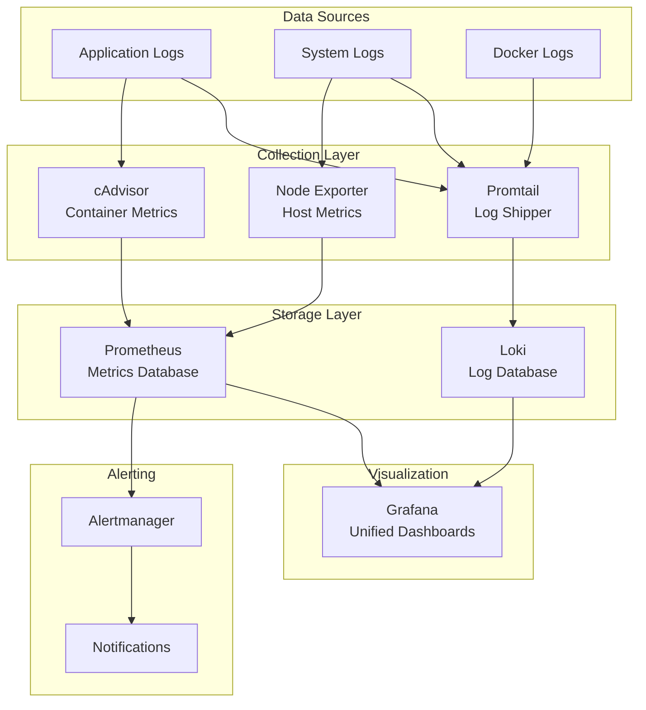

# Iteration 6: Enhanced Monitoring

**Status:** Not Started
**Duration:** 2-3 days
**Risk Level:** Low
**Downtime:** None
**Dependencies:** Iteration 5 completed

---

## Objectives

1. Deploy Loki for centralized log aggregation
2. Deploy Promtail for log collection
3. Create unified Grafana dashboards (metrics + logs)
4. Enhance Prometheus alert rules
5. Configure log retention policies
6. Implement dashboard templates

---

## Pre-Migration Checklist

- [ ] Iteration 5 validated and stable
- [ ] Current Prometheus/Grafana working
- [ ] Full system backup
- [ ] Plan log retention policy (disk space)
- [ ] Review current dashboards to enhance

---

## Architecture: Enhanced Monitoring



---

## Loki Configuration

### Add Loki Service

Create `monitoring/loki-config.yml`:

```yaml
auth_enabled: false

server:
  http_listen_port: 3100
  grpc_listen_port: 9096

common:
  path_prefix: /loki
  storage:
    filesystem:
      chunks_directory: /loki/chunks
      rules_directory: /loki/rules
  replication_factor: 1
  ring:
    instance_addr: 127.0.0.1
    kvstore:
      store: inmemory

schema_config:
  configs:
    - from: 2024-01-01
      store: boltdb-shipper
      object_store: filesystem
      schema: v11
      index:
        prefix: index_
        period: 24h

ruler:
  alertmanager_url: http://alertmanager:9093

limits_config:
  retention_period: 168h  # 7 days
  enforce_metric_name: false
  reject_old_samples: true
  reject_old_samples_max_age: 168h
  ingestion_rate_mb: 10
  ingestion_burst_size_mb: 20

chunk_store_config:
  max_look_back_period: 168h

table_manager:
  retention_deletes_enabled: true
  retention_period: 168h

compactor:
  working_directory: /loki/compactor
  shared_store: filesystem
  compaction_interval: 10m
  retention_enabled: true
  retention_delete_delay: 2h
  retention_delete_worker_count: 150
```

### Update monitoring/docker-compose.yml

```yaml
services:
  # ... existing services (prometheus, grafana, etc.)

  loki:
    image: grafana/loki:latest
    container_name: loki
    restart: unless-stopped

    user: "${PUID:-1000}:${PGID:-1000}"

    ports:
      - "3100:3100"

    volumes:
      - ./loki-config.yml:/etc/loki/loki-config.yml:ro
      - ./loki/data:/loki

    environment:
      - TZ=${TZ:-UTC}

    command: -config.file=/etc/loki/loki-config.yml

    deploy:
      resources:
        limits:
          memory: 512M
        reservations:
          memory: 128M

    networks:
      - mgmt-net

    healthcheck:
      test: ["CMD", "wget", "--spider", "-q", "http://127.0.0.1:3100/ready"]
      interval: 30s
      timeout: 10s
      retries: 3
      start_period: 30s

    labels:
      - "traefik.enable=true"
      - "traefik.http.routers.loki.rule=Host(`loki.lan`)"
      - "traefik.http.routers.loki.entrypoints=websecure"
      - "traefik.http.routers.loki.tls=true"
      - "traefik.http.routers.loki.middlewares=authelia@docker"
      - "traefik.http.services.loki.loadbalancer.server.port=3100"

  promtail:
    image: grafana/promtail:latest
    container_name: promtail
    restart: unless-stopped

    user: "0:0"  # Run as root to read all logs

    volumes:
      - ./promtail-config.yml:/etc/promtail/promtail-config.yml:ro
      - /var/log:/var/log:ro
      - /var/lib/docker/containers:/var/lib/docker/containers:ro
      - ../traefik/logs:/traefik-logs:ro

    environment:
      - TZ=${TZ:-UTC}

    command: -config.file=/etc/promtail/promtail-config.yml

    deploy:
      resources:
        limits:
          memory: 256M
        reservations:
          memory: 64M

    networks:
      - mgmt-net

    depends_on:
      - loki

    healthcheck:
      test: ["CMD", "wget", "--spider", "-q", "http://127.0.0.1:9080/ready"]
      interval: 30s
      timeout: 10s
      retries: 3
      start_period: 30s

    labels:
      - "traefik.enable=false"
```

---

## Promtail Configuration

Create `monitoring/promtail-config.yml`:

```yaml
server:
  http_listen_port: 9080
  grpc_listen_port: 0

positions:
  filename: /tmp/positions.yaml

clients:
  - url: http://loki:3100/loki/api/v1/push

scrape_configs:
  # Docker container logs
  - job_name: docker
    static_configs:
      - targets:
          - localhost
        labels:
          job: docker
          __path__: /var/lib/docker/containers/*/*-json.log

    pipeline_stages:
      - json:
          expressions:
            output: log
            stream: stream
            attrs: attrs
      - json:
          expressions:
            tag: attrs.tag
          source: attrs
      - regex:
          expression: (?P<container_name>(?:[^|]*[^|]))
          source: tag
      - timestamp:
          source: time
          format: RFC3339Nano
      - labels:
          stream:
          container_name:
      - output:
          source: output

  # System logs
  - job_name: system
    static_configs:
      - targets:
          - localhost
        labels:
          job: syslog
          __path__: /var/log/syslog

  # Traefik access logs
  - job_name: traefik
    static_configs:
      - targets:
          - localhost
        labels:
          job: traefik
          __path__: /traefik-logs/access.log

    pipeline_stages:
      - regex:
          expression: '.*"(?P<method>[A-Z]+) (?P<path>[^ ]+) [^"]*" (?P<status>\d+)'
      - labels:
          method:
          status:

  # Docker daemon logs
  - job_name: dockerd
    static_configs:
      - targets:
          - localhost
        labels:
          job: dockerd
          __path__: /var/log/docker.log
```

---

## Grafana Data Source Configuration

Update `monitoring/grafana/config/datasources/datasources.yml`:

```yaml
apiVersion: 1

datasources:
  # Prometheus (existing)
  - name: Prometheus
    type: prometheus
    access: proxy
    url: http://prometheus:9090
    isDefault: true
    editable: true

  # Loki (new)
  - name: Loki
    type: loki
    access: proxy
    url: http://loki:3100
    editable: true
    jsonData:
      maxLines: 1000
      derivedFields:
        - datasourceUid: Prometheus
          matcherRegex: "traceID=(\\w+)"
          name: TraceID
          url: "$${__value.raw}"
```

---

## Enhanced Dashboards

### Dashboard 1: System Overview

Create `monitoring/grafana/dashboards/system-overview.json`:

**Panels:**
1. Container Status (running/stopped)
2. CPU Usage per Container
3. Memory Usage per Container
4. Network Traffic
5. Recent Error Logs (from Loki)
6. Disk Usage
7. Uptime

### Dashboard 2: Application Logs

**Panels:**
1. Log stream (Loki)
2. Error rate over time
3. Top 10 error messages
4. Logs by service
5. HTTP status codes (from Traefik)
6. Request rate

### Dashboard 3: Service Health

**Panels:**
1. Health check status
2. Service response times
3. Error rates
4. Restart counts
5. Container resource usage
6. Alert status

---

## Enhanced Prometheus Rules

Create `monitoring/prometheus/config/alerts/service-alerts.yml`:

```yaml
groups:
  - name: service_health
    interval: 30s
    rules:
      # Container down
      - alert: ContainerDown
        expr: up{job="docker"} == 0
        for: 2m
        labels:
          severity: critical
        annotations:
          summary: "Container {{ $labels.instance }} is down"
          description: "{{ $labels.instance }} has been down for more than 2 minutes"

      # High CPU usage
      - alert: HighCPUUsage
        expr: rate(container_cpu_usage_seconds_total[5m]) > 0.8
        for: 5m
        labels:
          severity: warning
        annotations:
          summary: "High CPU usage on {{ $labels.name }}"
          description: "{{ $labels.name }} CPU usage is above 80%"

      # High memory usage
      - alert: HighContainerMemoryUsage
        expr: (container_memory_usage_bytes{container!=""} / container_spec_memory_limit_bytes{container!=""} > 0.9) and (container_spec_memory_limit_bytes{container!=""} > 0)
        for: 5m
        labels:
          severity: warning
        annotations:
          summary: "High memory usage in {{ $labels.container }}"
          description: "{{ $labels.container }} memory usage is above 90%"

      # Disk space low
      - alert: DiskSpaceLow
        expr: (node_filesystem_avail_bytes / node_filesystem_size_bytes) < 0.1
        for: 5m
        labels:
          severity: critical
        annotations:
          summary: "Low disk space on {{ $labels.instance }}"
          description: "Less than 10% disk space remaining"

      # High error rate
      - alert: HighErrorRate
        expr: rate(traefik_service_requests_total{code=~"5.."}[5m]) > 0.05
        for: 5m
        labels:
          severity: warning
        annotations:
          summary: "High error rate on {{ $labels.service }}"
          description: "Error rate above 5% for {{ $labels.service }}"

  - name: service_specific
    interval: 1m
    rules:
      # VPN connection down
      - alert: VPNConnectionDown
        expr: up{job="gluetun"} == 0
        for: 2m
        labels:
          severity: critical
        annotations:
          summary: "VPN connection is down"
          description: "Gluetun VPN has been down for more than 2 minutes"

      # Jellyfin unhealthy
      - alert: JellyfinUnhealthy
        expr: up{job="jellyfin"} == 0
        for: 5m
        labels:
          severity: warning
        annotations:
          summary: "Jellyfin is unhealthy"
          description: "Jellyfin has been unhealthy for more than 5 minutes"

      # Download queue stalled
      - alert: DownloadQueueStalled
        expr: qbittorrent_torrents_count{state="downloading"} > 5 AND rate(qbittorrent_download_bytes[10m]) == 0
        for: 30m
        labels:
          severity: warning
        annotations:
          summary: "Download queue appears stalled"
          description: "Multiple torrents queued but no download activity"
```

---

## Implementation Steps

### Step 1: Backup

```bash
cd /home/otterammo/media
mkdir -p backups/iter6-pre
cp -r monitoring/ backups/iter6-pre/
```

### Step 2: Create Configuration Files

```bash
cd monitoring

# Create Loki config
cat > loki-config.yml << 'EOF'
# (paste config from above)
EOF

# Create Promtail config
cat > promtail-config.yml << 'EOF'
# (paste config from above)
EOF

# Create directories
mkdir -p loki/data
mkdir -p grafana/dashboards
mkdir -p prometheus/config/alerts

# Set permissions
chown -R $PUID:$PGID loki/
chmod 755 loki/data
```

### Step 3: Update Grafana Data Sources

```bash
cat > grafana/config/datasources/datasources.yml << 'EOF'
# (paste config from above)
EOF
```

### Step 4: Create Alert Rules

```bash
cat > prometheus/config/alerts/service-alerts.yml << 'EOF'
# (paste config from above)
EOF
```

### Step 5: Update Prometheus Config

```bash
nano prometheus/config/prometheus.yml

# Add alerting rules
rule_files:
  - '/etc/prometheus/alerts/*.yml'
```

### Step 6: Update docker-compose.yml

```bash
nano monitoring/docker-compose.yml
# Add loki and promtail services
```

### Step 7: Deploy Services

```bash
cd /home/otterammo/media

# Validate configuration
docker-compose config --quiet

# Start Loki
docker-compose up -d loki
sleep 10

# Check Loki is ready
docker-compose logs loki | grep "ready"

# Start Promtail
docker-compose up -d promtail
sleep 5

# Restart Grafana to pick up new data source
docker-compose restart grafana

# Monitor logs
docker-compose logs -f loki promtail
```

### Step 8: Verify Log Collection

```bash
# Check Promtail is sending logs
curl http://localhost:9080/metrics | grep promtail_sent

# Query Loki for recent logs
curl -G -s "http://localhost:3100/loki/api/v1/query" \
  --data-urlencode 'query={job="docker"}' | jq

# Check in Grafana
# Go to Explore → Select Loki → Run query: {job="docker"}
```

### Step 9: Import Dashboards

1. Open Grafana (https://grafana.lan)
2. Go to Dashboards → Import
3. Import pre-built dashboards:
   - **Docker Dashboard**: ID 893
   - **Node Exporter Full**: ID 1860
   - **Loki Dashboard**: ID 13639
   - **Traefik**: ID 17346

Or create custom dashboards using the templates above.

### Step 10: Test Alerts

```bash
# Simulate high CPU (run in a container)
docker exec jellyfin sh -c "for i in 1 2 3 4; do dd if=/dev/zero of=/dev/null & done"

# Wait for alert to fire (check Alertmanager)
curl http://localhost:9093/api/v2/alerts | jq

# Stop CPU load
docker exec jellyfin killall dd
```

---

## Validation Tests

### Test 1: Loki Receiving Logs

```bash
# Query Loki
curl -G -s "http://localhost:3100/loki/api/v1/query" \
  --data-urlencode 'query={job="docker"}' \
  --data-urlencode 'limit=10' | jq '.data.result[].values'
```

### Test 2: Grafana Data Sources

1. Open Grafana
2. Configuration → Data Sources
3. Verify Prometheus (green check)
4. Verify Loki (green check)

### Test 3: Log Queries in Grafana

1. Go to Explore
2. Select "Loki" data source
3. Query: `{container_name="traefik"}`
4. Should show Traefik logs

### Test 4: Combined Metrics + Logs

1. Go to Dashboard
2. Add panel with Prometheus metric
3. Add panel with Loki logs
4. Verify both data sources work

### Test 5: Alerts

1. Go to Alerting → Alert Rules
2. Verify rules loaded
3. Check Alertmanager → Alerts
4. Should show current alert status

---

## Validation Checklist

- [ ] Loki service running and healthy
- [ ] Promtail service running and healthy
- [ ] Logs flowing into Loki
- [ ] Grafana shows Loki data source
- [ ] Can query logs in Grafana Explore
- [ ] Dashboards created/imported
- [ ] Alert rules loaded in Prometheus
- [ ] Alertmanager receiving alerts
- [ ] Log retention working (old logs deleted)
- [ ] No performance degradation

---

## Dashboards to Create/Import

### Import from Grafana.com

```bash
# Docker Dashboard
https://grafana.com/grafana/dashboards/893

# Node Exporter
https://grafana.com/grafana/dashboards/1860

# Loki Logs
https://grafana.com/grafana/dashboards/13639

# Traefik
https://grafana.com/grafana/dashboards/17346

# cAdvisor
https://grafana.com/grafana/dashboards/14282
```

### Custom Dashboard: Media Server Overview

**Panels:**
1. System Resources (CPU, Memory, Disk)
2. Service Status (Up/Down indicators)
3. Request Rate (from Traefik)
4. Error Logs (from Loki)
5. VPN Status
6. Download Activity
7. Recent Alerts

---

## Troubleshooting

### Issue: Loki Not Receiving Logs

**Solution:**
```bash
# Check Promtail logs
docker-compose logs promtail | grep error

# Verify Promtail can reach Loki
docker exec promtail wget -O- http://loki:3100/ready

# Check file paths in promtail-config.yml
docker exec promtail ls -la /var/lib/docker/containers/

# Restart Promtail
docker-compose restart promtail
```

### Issue: High Disk Usage

**Solution:**
```bash
# Check Loki data size
du -sh monitoring/loki/data/

# Reduce retention period
nano monitoring/loki-config.yml
# Set retention_period: 72h (3 days instead of 7)

# Restart Loki
docker-compose restart loki
```

### Issue: Grafana Can't Connect to Loki

**Solution:**
```bash
# Check networks
docker network inspect mgmt-net | grep -E "(loki|grafana)"

# Test connection
docker exec grafana wget -O- http://loki:3100/ready

# Verify data source URL in Grafana
# Should be: http://loki:3100
```

---

## Rollback Procedure

```bash
# Remove Loki and Promtail
docker-compose stop loki promtail
docker-compose rm -f loki promtail

# Restore previous configs
cp -r backups/iter6-pre/monitoring/* monitoring/

# Restart Grafana
docker-compose restart grafana
```

---

## Post-Migration Tasks

### Immediate
- [ ] Create key dashboards
- [ ] Set up alert notification channels
- [ ] Configure log retention based on disk space
- [ ] Document query examples

### Within 1 Week
- [ ] Review and tune alert thresholds
- [ ] Create runbooks for common alerts
- [ ] Set up dashboard sharing/export
- [ ] Prepare for Iteration 7 (Infrastructure Hardening)

---

## Success Criteria

✅ **Iteration 6 is successful if:**

1. Loki collecting logs from all services
2. Promtail shipping logs reliably
3. Grafana shows unified metrics + logs
4. Enhanced alert rules active
5. Dashboards provide actionable insights
6. Log retention working correctly
7. No performance impact on services

---

## Next Steps

**Ready for final iteration?** → [Iteration 7: Infrastructure Hardening](iteration-07-infrastructure-hardening.md)
