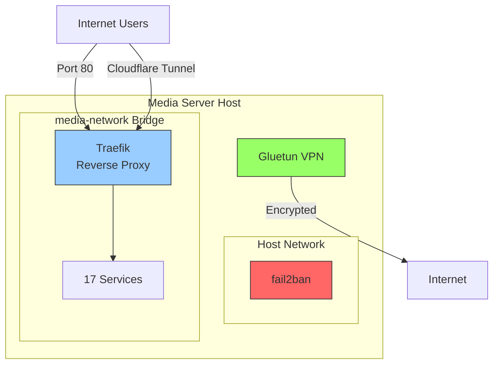
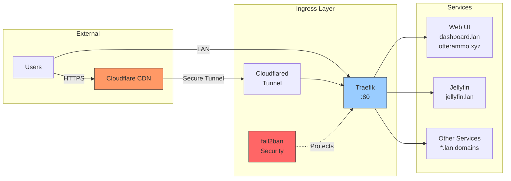
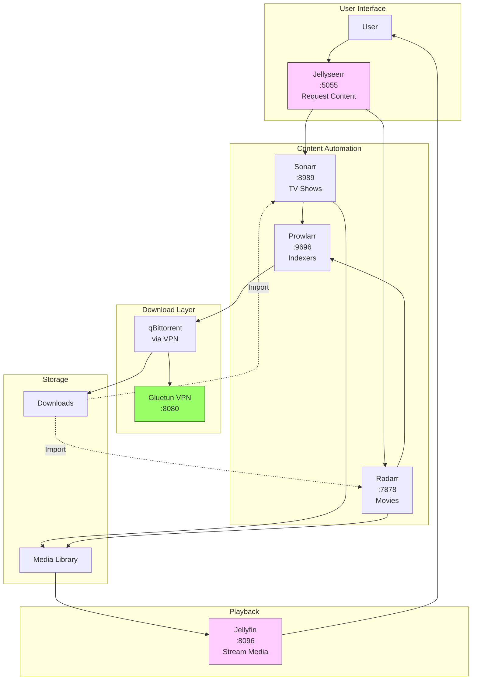
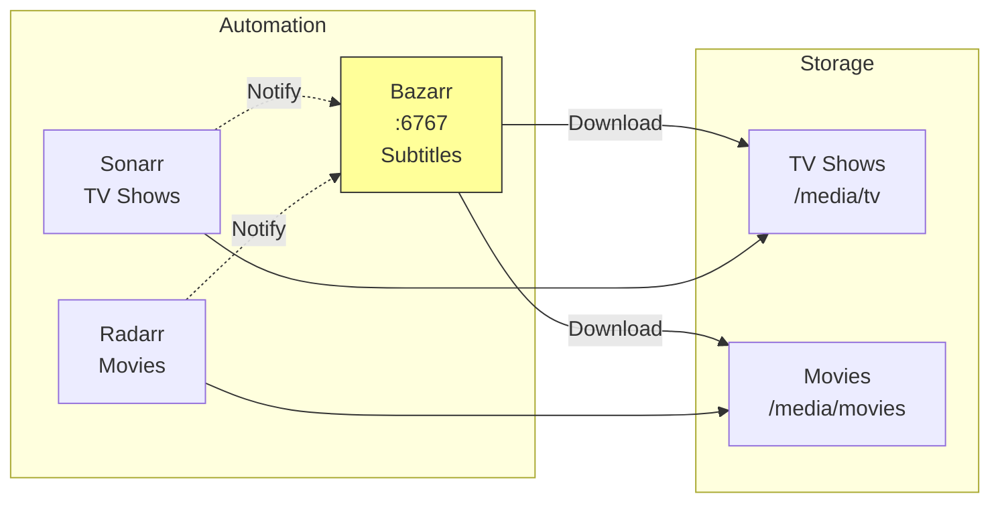
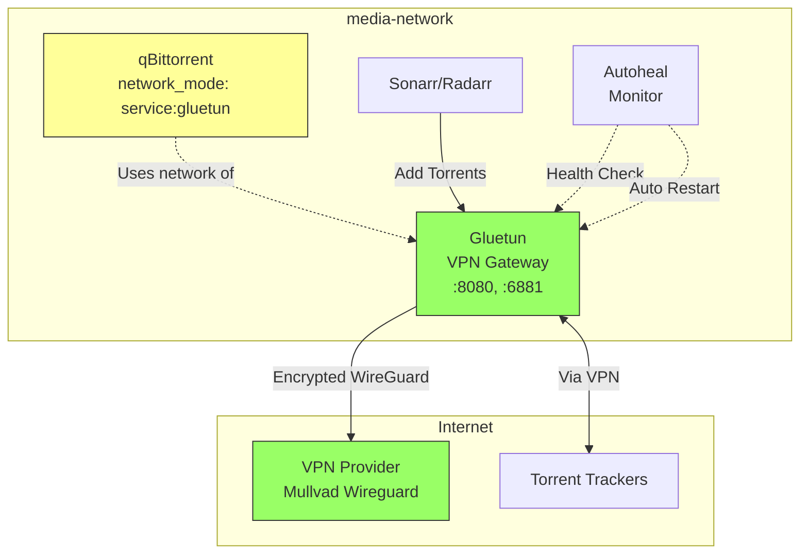
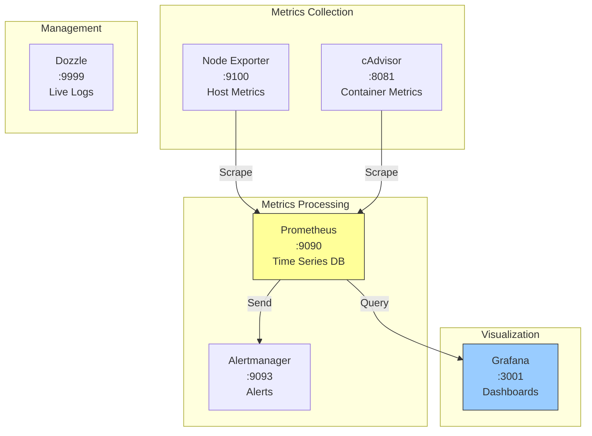
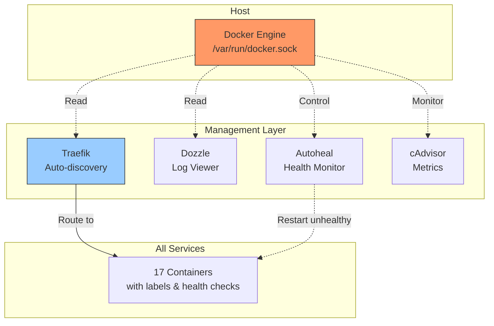

# Network Architecture Diagrams

## Overview
This document describes the network architecture for the media server host running Docker containers orchestrated through Docker Compose.

## 1. Network Topology Overview



## 2. External Access & Ingress



## 3. Media Content Flow



## 4. Subtitle Management Flow



## 5. VPN & Download Security



## 6. Monitoring Stack



## 7. Service Discovery & Management



## Network Topology Details

### Network Modes

1. **Bridge Network (media-network)**
   - Most services connect to this custom bridge network
   - Allows inter-container communication
   - Traefik discovers services via Docker socket

2. **Host Network**
   - `fail2ban`: Requires host network access to manage iptables and monitor system logs

3. **Service Network Mode**
   - `qbittorrent`: Uses Gluetun's network stack (`network_mode: service:gluetun`)
   - All qBittorrent traffic routes through VPN

### External Access

#### Public Access (via Cloudflare)
- Cloudflare Tunnel → Traefik → Web UI
- Domain: `otterammo.xyz`

#### Local Access (Direct)
- LAN clients → Traefik (port 80) → Services
- Local domain suffix: `.lan`

### Port Mappings

#### Host → Container Ports
- **80**: Traefik HTTP entry point
- **8090**: Traefik dashboard
- **8096**: Jellyfin (direct access)
- **5055**: Jellyseerr (direct access)
- **8989**: Sonarr (direct access)
- **7878**: Radarr (direct access)
- **9696**: Prowlarr (direct access)
- **6767**: Bazarr (direct access)
- **8080**: Gluetun/qBittorrent WebUI
- **6881**: Torrent traffic (TCP/UDP)
- **9090**: Prometheus
- **3001**: Grafana
- **8081**: cAdvisor
- **9100**: Node Exporter
- **9093**: Alertmanager
- **9999**: Dozzle
- **3000**: Web UI dashboard

### Service Communication Patterns

#### Content Request Flow
```
User → Jellyseerr → Sonarr/Radarr → Prowlarr (indexers) → qBittorrent (via Gluetun VPN) → Downloads
```

#### Content Organization Flow
```
Downloads → Sonarr/Radarr (organize) → Media Storage → Jellyfin (stream)
Bazarr → Download subtitles → Media Storage
```

#### Monitoring Flow
```
Node Exporter/cAdvisor → Prometheus → Grafana (visualization)
Prometheus → Alertmanager (alerts)
```

### Security Layers

1. **VPN Isolation**: All torrent traffic forced through Gluetun VPN
2. **Fail2ban**: Monitors logs and blocks malicious IPs at host level
3. **Traefik**: Reverse proxy with optional authentication
4. **Cloudflare Tunnel**: Secure external access without port forwarding
5. **Autoheal**: Automatically restarts unhealthy containers (monitors Gluetun)

### Storage Architecture

#### Volumes by Service Type
- **Config**: Persistent configuration for each service
- **Media**: Read-only for Jellyfin, read-write for automation services
- **Downloads**: Shared between qBittorrent and automation services
- **Monitoring Data**: Time-series databases for Prometheus
- **Logs**: Centralized logging for fail2ban and Traefik

### Dependencies

#### Service Start Order
1. Traefik (reverse proxy)
2. Gluetun (VPN gateway)
3. qBittorrent (requires Gluetun network)
4. Cloudflared (requires Traefik)
5. Jellyfin (media server)
6. Jellyseerr (requires Jellyfin)
7. Prometheus (metrics)
8. Grafana (requires Prometheus)

### Resource Allocation

#### Memory Limits
- **Heavy**: Jellyfin (2GB), qBittorrent (4GB), Sonarr (1GB)
- **Medium**: Grafana (256MB), Radarr/Bazarr (512MB)
- **Light**: Prometheus/Alertmanager/cAdvisor (128-512MB)

### Health Monitoring

All services implement health checks:
- **HTTP-based**: Most web services (curl/wget to health endpoints)
- **Command-based**: fail2ban (fail2ban-client ping)
- **VPN-specific**: Gluetun (connectivity to 1.1.1.1:443)

### Key Features

1. **Auto-healing**: Gluetun VPN container auto-restarts on failure
2. **Service Discovery**: Traefik auto-discovers services via Docker labels
3. **Centralized Logging**: Dozzle provides real-time log aggregation
4. **Metrics Collection**: Full stack monitoring with Prometheus/Grafana
5. **Secure Downloads**: VPN kill-switch ensures no leaks
