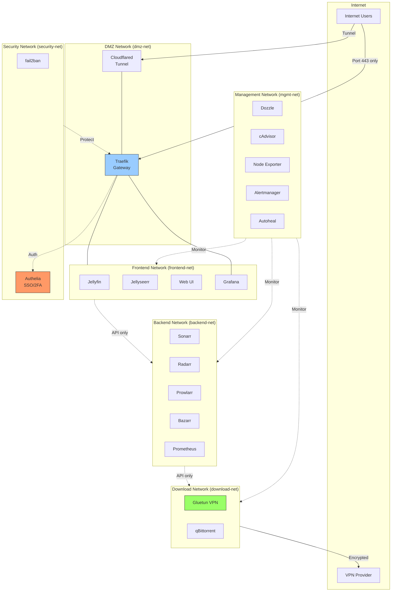
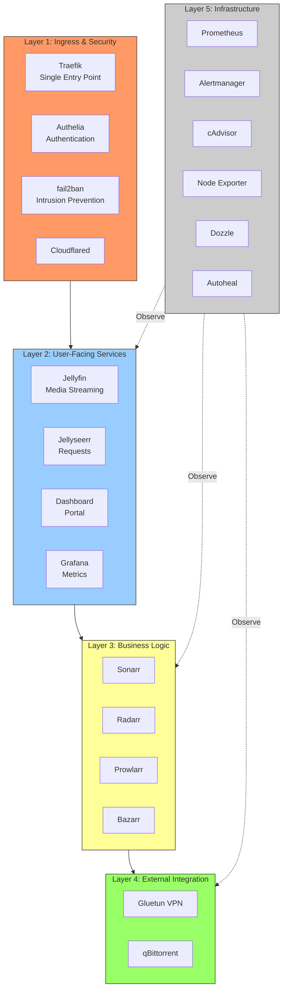
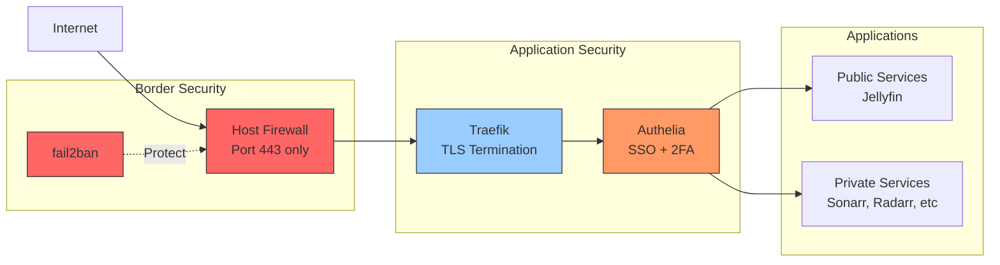
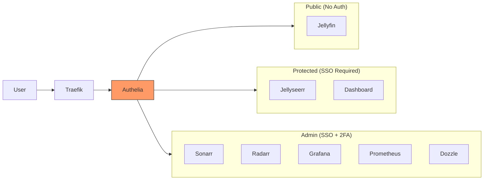
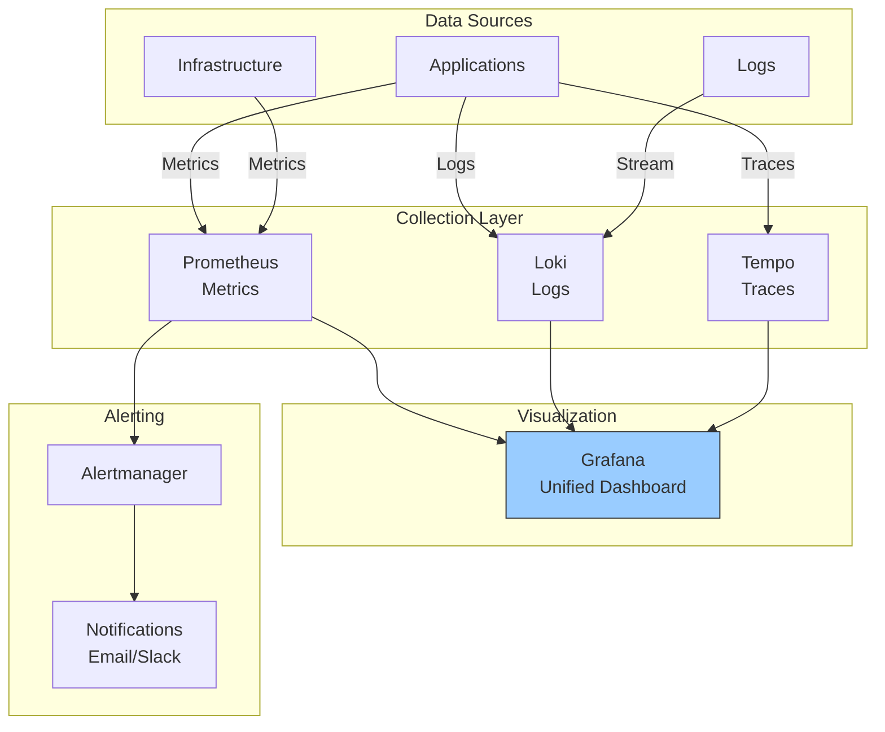

# Proposed Clean Architecture

## Executive Summary

This document proposes a redesigned architecture that addresses several design concerns in the current setup:

1. **Network segmentation** - Separate networks by security zone and purpose
2. **Port exposure** - Minimize direct port mappings, use reverse proxy exclusively
3. **Separation of concerns** - Clear boundaries between ingress, application, and infrastructure layers
4. **Security hardening** - Defense in depth with multiple security layers
5. **Scalability** - Easier to add/remove services without conflicts

---

## Current Architecture Issues

### Problems Identified

1. **Flat network topology** - All services on same network (media-network)
2. **Mixed port exposure** - Some services exposed directly (bypass Traefik), some through proxy
3. **No network segmentation** - Download services share network with media/monitoring
4. **Security boundaries unclear** - VPN traffic mixes with management traffic
5. **fail2ban on host network** - Could be containerized with proper network access
6. **Service discovery coupling** - All services tightly coupled through single Docker socket

---

## Proposed Architecture

### 1. Network Topology



### 2. Layered Architecture



### 3. Traffic Flow with Security Boundaries



---

## Detailed Design

### Network Definitions

```yaml
networks:
  # DMZ - Only Traefik and Cloudflared
  dmz-net:
    name: dmz-net
    driver: bridge
    ipam:
      config:
        - subnet: 172.20.0.0/24

  # Frontend - User-facing services
  frontend-net:
    name: frontend-net
    driver: bridge
    internal: true  # No direct internet access
    ipam:
      config:
        - subnet: 172.20.1.0/24

  # Backend - Business logic services
  backend-net:
    name: backend-net
    driver: bridge
    internal: true
    ipam:
      config:
        - subnet: 172.20.2.0/24

  # Download - VPN-routed download services
  download-net:
    name: download-net
    driver: bridge
    ipam:
      config:
        - subnet: 172.20.3.0/24

  # Management - Infrastructure services
  mgmt-net:
    name: mgmt-net
    driver: bridge
    internal: true
    ipam:
      config:
        - subnet: 172.20.4.0/24

  # Security - Security services
  security-net:
    name: security-net
    driver: bridge
    ipam:
      config:
        - subnet: 172.20.5.0/24
```

### Service Network Assignments

| Service | Networks | Justification |
|---------|----------|---------------|
| **Traefik** | dmz-net, frontend-net, security-net | Gateway between external and internal |
| **Cloudflared** | dmz-net | External tunnel endpoint |
| **Authelia** | security-net, frontend-net | Authentication for all services |
| **fail2ban** | security-net | Monitors Traefik logs, manages iptables |
| **Jellyfin** | frontend-net | Public-facing media server |
| **Jellyseerr** | frontend-net, backend-net | User requests to automation |
| **Web UI** | frontend-net | Dashboard portal |
| **Grafana** | frontend-net, mgmt-net | Metrics visualization |
| **Sonarr** | backend-net, download-net | Business logic + download integration |
| **Radarr** | backend-net, download-net | Business logic + download integration |
| **Prowlarr** | backend-net, download-net | Indexer management |
| **Bazarr** | backend-net | Subtitle automation |
| **Gluetun** | download-net | VPN gateway |
| **qBittorrent** | Uses Gluetun network | Isolated download client |
| **Prometheus** | mgmt-net, frontend-net, backend-net, download-net | Collects from all layers |
| **Alertmanager** | mgmt-net | Alert routing |
| **cAdvisor** | mgmt-net | Container metrics |
| **Node Exporter** | mgmt-net | Host metrics |
| **Dozzle** | mgmt-net | Log aggregation |
| **Autoheal** | mgmt-net | Container health management |

### Port Exposure Strategy

**Current Issues:**
- Multiple services expose ports directly (8096, 5055, 8989, 7878, etc.)
- Creates attack surface
- Bypasses centralized access control

**Proposed Solution:**

```yaml
# ONLY expose these ports on the host:
ports:
  - "443:443"     # Traefik HTTPS (only port open to internet)
  - "80:80"       # Traefik HTTP (redirects to HTTPS)

# ALL other services accessed through Traefik only
# NO direct port mappings for application services
```

### Authentication & Authorization

Add Authelia for SSO and 2FA:



**Authelia Configuration:**

```yaml
authelia:
  image: authelia/authelia:latest
  container_name: authelia
  networks:
    - security-net
    - frontend-net
  environment:
    - TZ=${TZ}
  volumes:
    - ./authelia/config:/config
  labels:
    - "traefik.enable=true"
    - "traefik.http.routers.authelia.rule=Host(`auth${DOMAIN_SUFFIX}`)"

    # Middleware for all protected services
    - "traefik.http.middlewares.authelia.forwardAuth.address=http://authelia:9091/api/verify?rd=https://auth${DOMAIN_SUFFIX}"
    - "traefik.http.middlewares.authelia.forwardAuth.trustForwardHeader=true"
```

**Access Control Rules:**

```yaml
# authelia/config/configuration.yml
access_control:
  default_policy: deny

  rules:
    # Public - No authentication
    - domain:
        - "jellyfin.local"
        - "otterammo.xyz"
      policy: bypass

    # Protected - Single factor (username/password)
    - domain:
        - "jellyseerr.local"
        - "dashboard.local"
      policy: one_factor

    # Admin - Two factor required
    - domain:
        - "sonarr.local"
        - "radarr.local"
        - "prowlarr.local"
        - "bazarr.local"
        - "qbittorrent.local"
        - "grafana.local"
        - "prometheus.local"
        - "traefik.local"
        - "dozzle.local"
      policy: two_factor
```

---

## Security Improvements

### 1. Network Segmentation Benefits

**Current:** Single flat network
- Compromised service = full network access
- No containment of security incidents

**Proposed:** Multi-tier segmentation
- Lateral movement restricted
- Blast radius contained
- Clear security boundaries

### 2. Defense in Depth

```
Layer 1: Host Firewall (only 80, 443 open)
    ↓
Layer 2: fail2ban (intrusion prevention)
    ↓
Layer 3: Traefik (TLS termination, rate limiting)
    ↓
Layer 4: Authelia (authentication, 2FA)
    ↓
Layer 5: Application (service-level security)
```

### 3. Secrets Management

**Add:** Docker Secrets or External Secrets Operator

```yaml
secrets:
  cloudflare_token:
    file: ./secrets/cloudflare_token.txt
  vpn_private_key:
    file: ./secrets/vpn_private_key.txt
  authelia_jwt:
    file: ./secrets/authelia_jwt.txt

services:
  cloudflared:
    secrets:
      - cloudflare_token
    environment:
      - CLOUDFLARE_TUNNEL_TOKEN_FILE=/run/secrets/cloudflare_token
```

### 4. TLS Everywhere

**Current:** HTTP between Traefik and services

**Proposed:** TLS termination at Traefik, mTLS between services (optional)

```yaml
# Traefik config
entrypoints:
  web:
    address: ":80"
    http:
      redirections:
        entryPoint:
          to: websecure
          scheme: https

  websecure:
    address: ":443"
    http:
      tls:
        certResolver: letsencrypt
```

---

## Migration Strategy

### Phase 1: Network Segmentation (Low Risk)
1. Create new networks
2. Assign services to multiple networks
3. Test connectivity between layers
4. Remove old media-network

### Phase 2: Port Consolidation (Medium Risk)
1. Remove direct port mappings one service at a time
2. Verify Traefik routing works
3. Update firewall rules
4. Test external and internal access

### Phase 3: Authentication Layer (Medium Risk)
1. Deploy Authelia
2. Configure access control rules
3. Add Traefik middleware for protected services
4. Test authentication flow
5. Enable 2FA for admin services

### Phase 4: TLS Hardening (Low Risk)
1. Configure Let's Encrypt in Traefik
2. Enable automatic cert renewal
3. Force HTTPS redirects
4. Update service URLs

### Phase 5: Secrets Management (Low Risk)
1. Extract secrets to files
2. Configure Docker secrets
3. Update service configurations
4. Remove plaintext secrets from .env

---

## Monitoring & Observability

### Proposed Architecture



**Add Loki for centralized logging:**

```yaml
loki:
  image: grafana/loki:latest
  container_name: loki
  networks:
    - mgmt-net
  volumes:
    - ./loki/config:/etc/loki
    - ./loki/data:/loki
  command: -config.file=/etc/loki/loki-config.yml

promtail:
  image: grafana/promtail:latest
  container_name: promtail
  networks:
    - mgmt-net
  volumes:
    - /var/log:/var/log:ro
    - /var/lib/docker/containers:/var/lib/docker/containers:ro
    - ./promtail/config:/etc/promtail
  command: -config.file=/etc/promtail/promtail-config.yml
```

---

## Infrastructure as Code

### Current State
- Manual docker-compose files
- Configuration drift risk
- No version control for configs

### Proposed Improvements

1. **Environment-based configuration**
```bash
environments/
  ├── dev/
  │   ├── .env
  │   └── docker-compose.override.yml
  ├── staging/
  │   ├── .env
  │   └── docker-compose.override.yml
  └── production/
      ├── .env
      └── docker-compose.override.yml
```

2. **Configuration validation**
```yaml
# Add to CI/CD pipeline
- docker-compose config --quiet
- yamllint docker-compose*.yml
- shellcheck scripts/*.sh
```

3. **Automated backups**
```yaml
backup:
  image: offen/docker-volume-backup:latest
  container_name: backup
  networks:
    - mgmt-net
  volumes:
    - ./jellyfin/config:/backup/jellyfin-config:ro
    - ./sonarr/config:/backup/sonarr-config:ro
    - ./radarr/config:/backup/radarr-config:ro
    - /mnt/backups:/archive
  environment:
    - BACKUP_CRON_EXPRESSION=0 2 * * *
    - BACKUP_RETENTION_DAYS=30
```

---

## Performance Optimizations

### 1. Service Resource Limits (Enforce)

**Current:** Some services have limits, inconsistent

**Proposed:** Consistent resource management

```yaml
x-resource-defaults: &default-resources
  deploy:
    resources:
      limits:
        memory: 512M
      reservations:
        memory: 128M

x-heavy-resources: &heavy-resources
  deploy:
    resources:
      limits:
        memory: 2G
      reservations:
        memory: 512M

services:
  jellyfin:
    <<: *heavy-resources

  sonarr:
    <<: *default-resources
```

### 2. Network Performance

**Add network optimizations:**

```yaml
networks:
  frontend-net:
    driver: bridge
    driver_opts:
      com.docker.network.bridge.name: br-frontend
      com.docker.network.driver.mtu: 1500
    ipam:
      driver: default
      config:
        - subnet: 172.20.1.0/24
          gateway: 172.20.1.1
```

### 3. Storage Optimization

**Proposed structure:**

```
/mnt/storage/
  ├── media/          # Media library (optimized for streaming)
  ├── downloads/      # Download cache (fast disk)
  ├── configs/        # Service configs (SSD/fast disk)
  └── monitoring/     # Metrics data (time-series optimized)
```

---

## Summary of Improvements

| Aspect | Current | Proposed | Benefit |
|--------|---------|----------|---------|
| **Networks** | 1 flat network | 6 segmented networks | Security isolation |
| **Port Exposure** | 15+ direct ports | 2 ports (80, 443) | Reduced attack surface |
| **Authentication** | Per-service | Centralized SSO + 2FA | Consistent security |
| **TLS** | HTTP internal | HTTPS everywhere | Encryption in transit |
| **Secrets** | .env plaintext | Docker secrets | Secret protection |
| **Monitoring** | Metrics only | Metrics + Logs + Traces | Full observability |
| **Access Control** | None | Role-based (public/user/admin) | Principle of least privilege |
| **Network Security** | Flat | Defense in depth | Multiple security layers |

---

## Next Steps

1. Review and approve architecture
2. Create detailed migration plan
3. Set up test environment
4. Implement phase 1 (network segmentation)
5. Validate and iterate
6. Continue with subsequent phases
